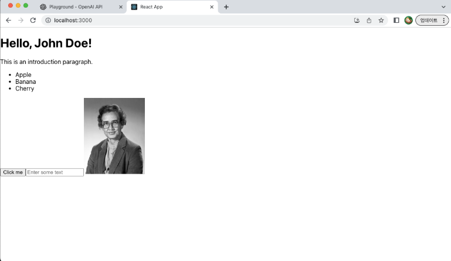

# 📘 Chapter 4. JSX와 요소 렌더링

---

## 💡 JSX란?

-   **JSX (JavaScript XML)**
    -   **JavaScript 안**에서 **HTML처럼 보이는 코드**를 작성할 수 있게 해주는 문법 확장
    -   사람이 읽기 쉬운 UI 코드 구조화 방식

-   JSX는 **실제로는 JavaScript**
    -   브라우저에 도달하기 전에 컴파일 도구(Babel 등) ➡️ `React.createElement(...)` 형태의 JS 코드로 변환
    -   약간의 차이점 있음
        - **CSS** 클래스 : `class` ➡️ **`className`** 사용
        - **중괄호 { } 내에서 JavaScript 표현식을 사용**

📦 예시:

<table style="border-collapse: collapse; width: 100%;">
  <thead>
    <tr>
      <th style="width: 50%; border: 2px solid #ccc; padding: 10px;">예시 코드</th>
      <th style="width: 50%; border: 2px solid #ccc; padding: 10px;">플로우차트</th>
    </tr>
  </thead>
  <tbody>
    <tr>
      <td style="vertical-align: top; padding: 10px; border: 2px solid #ccc;">
        
<strong>JSX 예시 코드:</strong>

        <pre><code class="language-jsx">
const element = &lt;h1 className="greeting"&gt;Hello, world!&lt;/h1&gt;;
        </code></pre>
      </td>
      <td rowspan="3" style="vertical-align: middle; text-align: center; padding: 10px; border: 2px solid #ccc;">
        
<strong>JSX 실행 흐름 플로우차트</strong>

        
        
(클릭 시 원본 이미지 확인)

      </td>
    </tr>
    <tr>
      <td style="vertical-align: top; padding: 10px; border: 2px solid #ccc;">
        
<strong>JS 변환 예시 코드:</strong>

        <pre><code class="language-js">
const element = React.createElement(
  "h1",
  { className: "greeting" },
  "Hello, world!"
);
        </code></pre>
      </td>
    </tr>
    <tr>
      <td style="vertical-align: top; padding: 10px; border: 2px solid #ccc;">
        
<strong>JSX 실행 과정:</strong>

        <ol style="margin-left: 0; padding-left: 20px;">
          <li>**JSX 코드 작성**</li>
          <li>**Babel(트랜스파일러)** 변환</li>
          <li>`React.createElement()`로 변형</li>
          <li>**가상 DOM 트리 생성**</li>
          <li>**Diff 알고리즘**으로 변경 비교</li>
          <li>**필요한 부분만 실제 DOM 업데이트**</li>
        </ol>
        

          ⚛️ <strong>JSX의 실행 흐름:</strong> 
          JSX는 마치 디자이너가 **설계도**를 그리면 React가 그걸 **실제 건축 자재**로 **바꿔 조립해주는 중간 작업자** 같은 역할 담당
        

      </td>
    </tr>
  </tbody>
</table>

-----

## 🧩 JSX에서 JavaScript 사용하기

<table style="border-collapse: collapse; width: 100%;">
  <thead>
    <tr>
      <th style="border: 2px solid #ccc; padding: 10px; width: 33%;">JSX에서 JavaScript 사용하기</th>
      <th style="border: 2px solid #ccc; padding: 10px; width: 33%;">DOM에 요소 렌더링하기</th>
      <th style="border: 2px solid #ccc; padding: 10px; width: 34%;">🚀 `App` 컴포넌트에서 JSX 예시 정리</th>
    </tr>
  </thead>
  <tbody>
    <tr>
      <td style="vertical-align: top; padding: 10px; border: 2px solid #ccc;">
        
 - JSX 안에서는 <strong>중괄호 `{}`</strong> 안에 JS 표현식을 넣는 것 가능

        <pre><code class="language-jsx">
const name = 'John';
const element = &lt;h1&gt;Hello, {name}!&lt;/h1&gt;;
        </code></pre>
        
 - 함수 호출, 계산 등도 모두 포함 가능

        <pre><code class="language-js">
function formatName(user) {
  return user.firstName + ' ' + user.lastName;
}
        </code></pre>
        <pre><code class="language-js">
const element = &lt;h1&gt;Hello, {formatName(user)}!&lt;/h1&gt;;
        </code></pre>
      </td>
      <td style="vertical-align: top; padding: 10px; border: 2px solid #ccc;">
        
 - React 앱은 <strong>직접 DOM을 조작하지 않고, `ReactDOM.render()`</strong>를 사용해 HTML의 특정 DOM 위치에 요소를 <strong>렌더링</strong>

        <pre><code class="language-jsx">
const element = &lt;h1&gt;Hello, world&lt;/h1&gt;;
ReactDOM.render(
  element,
  document.getElementById('root')
);
        </code></pre>
        
 - `ReactDOM.render()` = 2개의 인수 = <strong>렌더링할 요소, 렌더링할 위치</strong>

        
 - <strong>`h1 element`, `id = root`인 DOM 노드에 렌더링</strong>

        
 - 이때부터 <strong>React의 가상 DOM, 비교(`diff`), 최소 DOM 변경이 자동으로 적용</strong>

      </td>
<td style="vertical-align: top; padding: 10px; border: 2px solid #ccc;">
  
- 다양한 JSX 요소를 포함하는 간단한 React 컴포넌트 생성해보기

  
<strong>- `App.js`</strong>

  <pre style="font-size: 0.8em;"><code class="language-jsx">
function App() {
  const name = "John";
  const items = ["Apple", "Banana", "Cherry"];

  return (
    &lt;div className="App"&gt;
      &lt;h1&gt;Hello, {name}!&lt;/h1&gt;
      &lt;p className="intro"&gt;소개 문단입니다.&lt;/p&gt;
      &lt;ul&gt;
        {items.map((item, i) =&gt; &lt;li key={i}&gt;{item}&lt;/li&gt;)}
      &lt;/ul&gt;
      &lt;button onClick={() =&gt; alert("Clicked!")}&gt;Click me&lt;/button&gt;
      &lt;input type="text" placeholder="Enter text" /&gt;
      &lt;img src="https://i.imgur.com/MK3eW3Am.jpg" alt="placeholder" /&gt;
    &lt;/div&gt;
  );
}
export default App;
  </code></pre>
  <h4 style="margin-top: 20px;">코드 살펴보기:</h4>
  <ul>
    <li><strong>`const name = "John";`</strong>: `name` 변수를 선언하여 JSX 내에서 사용.</li>
    <li><strong>`const items = ["Apple", "Banana", "Cherry"];`</strong>: 배열을 선언하고 `.map()`을 사용하여 리스트 렌더링.</li>
    <li><strong>`&lt;h1&gt;Hello, {name}!&lt;/h1&gt;`</strong>: 중괄호 `{}` 안에 JS 변수 사용.</li>
    <li><strong>`&lt;ul&gt;...&lt;/ul&gt;`</strong>: JS의 `.map()` 함수를 통해 배열을 JSX 요소 리스트로 변환.</li>
    <li><strong>`&lt;li key={i}&gt;{item}&lt;/li&gt;`</strong>: 리스트 렌더링 시 `key` 속성 필수.</li>
    <li><strong>`&lt;button onClick={() =&gt; alert("Clicked!")}&gt;`</strong>: 이벤트 핸들링은 `{}` 안에 JS 함수로 작성.</li>
    <li><strong>`&lt;input type="text" /&gt;`, `&lt;img src="..." /&gt;`</strong>: 자체 닫힘 태그 사용 (`/>`).</li>
    <li><strong>`export default App;`</strong>: 컴포넌트를 외부에서 사용할 수 있도록 내보내기.</li>
  </ul>
</td>
      </td>
    </tr>
    <tr>
      <td colspan="3" style="vertical-align: middle; text-align: center; padding: 10px; border: 2px solid #ccc;">
        
<strong>작성된 App 예시</strong>

        
        
(클릭 시 원본 이미지 확인)

      </td>
    </tr>
  </tbody>
</table>

---

### 🔍 특징 요약

  - **JS 표현식 포함**: `{name}`, `{map()}` 등을 중괄호로 감쌈
  - **속성 주의**: `class → className`, `for → htmlFor` 변경
  - **이벤트 처리**: `onClick={() => { ... }}`와 같이 함수로 처리
  - **리스트 출력 시 `key` 필수**: `<li key={...}>...</li>` 형식
  - **자체 닫힘 태그(XHTML 스타일)**: ``, `<input />` 등은 `/>`로 닫음

📌 JSX는 한 눈에 구조 파악 가능, JS 문법 혼용 가능하여 직관적이고 유지보수 쉬운 코드 작성을 도움

-----

## 📋 최종 요약 표

| 항목                   | 설명                                                                                                |
| :--------------------- | :-------------------------------------------------------------------------------------------------- |
| **JSX** | JS 안에서 HTML처럼 구조화된 UI 코드 작성 방식                                                 |
| **JSX → JS 변환 방식** | Babel 등으로 `React.createElement(...)` 코드로 컴파일                                            |
| **`{}` (중괄호)** | JSX 안에서 JS 표현식을 쓰는 문법 (`name`, `map()`, `함수 호출` 등)                                    |
| **`className` 등** | `class → className`, `for → htmlFor` 등 HTML과 차이 주의                                              |
| **DOM 렌더링** | `ReactDOM.render(element, DOM 위치)`로 수행                                                         |
| **조건/반복 렌더링** | JSX 내 `if`, `map`, `삼항연산자` 등으로 다양하게 구현 가능                                             |
| **이벤트 처리** | JS 함수 형태로 `onClick`, `onChange` 등 처리                                                        |
| **자체 닫힘 태그** | ``, `<input />` 등은 반드시 `/>`로 닫아야 오류 없음                                              |
| **React의 업데이트** | 변경 전후 가상 DOM을 비교(`diff`), 실제 DOM에는 필요한 부분만 업데이트                              |

## 📝 정리 한 줄 요약

> JSX는 **HTML처럼 코드를 쓰면서 JavaScript 표현식을 자유롭게 담을 수 있는**
> React만의 선언적 UI 구성 방식 ✨

