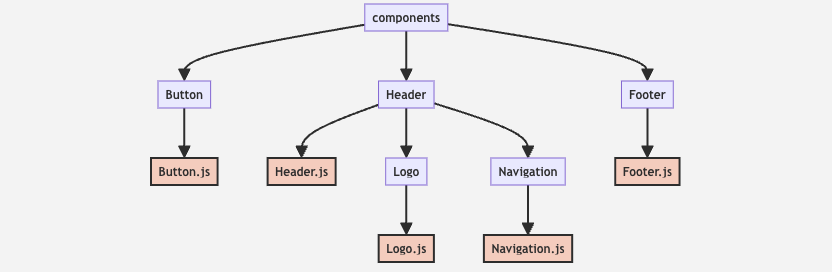

# 📘 Chapter 5. 컴포넌트 구성과 재사용성

---

## 📝 다양한 컴포넌트 구성과 예시

<table style="border-collapse: collapse; width: 100%;">
  <thead>
    <tr>
      <th style="border: 2px solid #ccc; padding: 10px; width: 10%;"></th> <th style="border: 2px solid #ccc; padding: 10px; width: 30%;">단일 책임 컴포넌트 생성🎯</th> <th style="border: 2px solid #ccc; padding: 10px; width: 30%;">복합 컴포넌트 구성 🏗️</th> <th style="border: 2px solid #ccc; padding: 10px; width: 30%;">컴포넌트 디렉토리 구조 구성 📁</th> </tr>
  </thead>
  <tbody>
    <tr>
      <td style="vertical-align: top; padding: 10px; border: 2px solid #ccc;"><strong>특징</strong></td> <td style="vertical-align: top; padding: 10px; border: 2px solid #ccc;">
        <ul>
          <li>하나의 컴포넌트는 <strong>단 하나의 역할(단일 책임)</strong>을 갖도록 설계</li>
          <li><code>`props`</code>를 통해 외부에서 기능/데이터만 주입받아 동작</li>
          <li>재사용성과 유지보수성이 높은 구조</li>
        </ul>
      </td> <td style="vertical-align: top; padding: 10px; border: 2px solid #ccc;">
        <ul>
          <li>여러 개 <strong>작은 컴포넌트</strong>를 <strong>하나의 큰 컴포넌트</strong>로 구성 가능</li>
          <li>UI를 각 역할로 나눠서 조립식 구성</li>
          <li><strong>유지보수성과 개발 분업에 용이</strong></li>
        </ul>
      </td> <td style="vertical-align: top; padding: 10px; border: 2px solid #ccc;">
        <ul>
          <li>폴더를 기능 기준으로 그룹화</li>
          <li><code>`/components/`</code> 루트 아래 기능 단위로 폴더 분리</li>
          <li><strong>구성 요소별로 각자의 공간 + 확장 가능</strong>한 구조 생성</li>
        </ul>
      </td> </tr>
    <tr>
      <td style="vertical-align: top; padding: 10px; border: 2px solid #ccc;">📦 예시</td> <td style="vertical-align: top; padding: 10px; border: 2px solid #ccc;">
      
✅ <code>Button</code> 컴포넌트 생성

        <pre><code class="language-jsx">
function Button(props) {
  return (
    &lt;button className="custom-button"&gt;
      {props.label}
    &lt;/button&gt;
  );
}
        </code></pre>
        
 - <code>props</code>를 인수로 받음 = 부모 컴포넌트에서 <strong>전달된 속성</strong>을 보유하는 객체

        
 - 이 코드에서는 <code>label prop</code>속성 = 버튼에 표시되는 텍스트

        
 - <strong>App 전체에 필요한 모든 버튼에 재사용 가능</strong>

      </td> <td style="vertical-align: top; padding: 10px; border: 2px solid #ccc;">
        
🏷️ <code>Header</code> 컴포넌트 살펴보기

        <pre><code class="language-jsx">
function Header() {
  return (
    &lt;header&gt;
      &lt;Logo /&gt;
      &lt;Navigation /&gt;
    &lt;/header&gt;
  );
}
        </code></pre>
        
 - <strong><code>Logo</code>, <code>Navigation</code> = 각각 개별적으로 정의된 컴포넌트</strong>

        
 - 개별적으로 컴포넌트 정의 후 ➡️ <code>Header</code>컴포넌트 내에서 사용 ➡️ <strong>더 복잡한 UI 요소 생성</strong>

        
 - <strong>코드의 모듈화 ➡️ 유지 보수 용이</strong>

      </td> <td style="vertical-align: top; padding: 10px; border: 2px solid #ccc;">
        
📁 예시 구조:

        <pre><code>
/components
  ├── Button/
  │   └── Button.js
  ├── Header/
  │   ├── Header.js
  │   └── Logo/
  │       └── Logo.js
  │   └── Navigation/
  │       └── Navigation.js
  └── Footer/
      └── Footer.js
        </code></pre>
        
 - 대규모 프로젝트에서 컴포넌트에 일관적 구조 유지가 중요 ➡️ <storng>기능별로 컴포넌트 그룹화</strogn>추천

        
 - 루트 디렉토리 = <code>/components</code> ➡️ (하위) 앱의 주요 기능 or 섹션에 대한 하위 디렉토리 추가

      </td> </tr>
    <tr>
      <td style="vertical-align: top; padding: 10px; border: 2px solid #ccc;">🌱 비유</td> <td style="vertical-align: top; padding: 10px; border: 2px solid #ccc;">
        
- <code>Button</code>은 하나의 레고 블록 ➡️ 글자만 바꿔서 얼마든지 다양한 버튼으로 활용 가능한 단순 기능 블록

        
- 버튼 내용은 부모가 주는 <code>label</code>만 보고 출력만 책임짐

      </td> <td style="vertical-align: top; padding: 10px; border: 2px solid #ccc;">
        
- <code>Header</code>는 단순히 구조를 담당하는 껍데기 역할. 실제 화면은 내부의 <code><Logo /></code>와 <code><Navigation /></code>에서 담당

      </td> <td style="vertical-align: top; padding: 10px; border: 2px solid #ccc;">
        
- ‘마을’을 지을 때, 집<code>(House.js)</code>, 표지판<code>(Logo.js)</code>, 길찾기<code>(Navigation.js)</code>처럼 부품 단위로 분리 제작하는 설계 방식

      </td> </tr>
  </tbody>
</table>

-----

## 🔹 실제 코드 예시 ✨

<table style="border-collapse: collapse; width: 100%;">
  <thead>
    <tr>
      <th colspan="3" style="border: 2px solid #ccc; padding: 10px; text-align: center;">
        
<strong>React 컴포넌트들의 역할과 상호 관계</strong>

        
        
(클릭 시 원본 이미지 확인)

      </th>
    </tr>
    <tr>
      <th style="border: 2px solid #ccc; padding: 10px; width: 20%;">파일</th> <th style="border: 2px solid #ccc; padding: 10px; width: 20%;">코드 요약</th> <th style="border: 2px solid #ccc; padding: 10px; width: 60%;">예시 코드</th> </tr>
  </thead>
  <tbody>
    <tr>
      <td style="vertical-align: top; padding: 10px; border: 2px solid #ccc;">🔸 <code>Button.js</code></td>
      <td style="vertical-align: top; padding: 10px; border: 2px solid #ccc;"><code>props.label</code>을 받아 출력하는 단일 버튼</td>
      <td style="vertical-align: top; padding: 10px; border: 2px solid #ccc;">
        <pre style="font-size: 0.8em;"><code class="language-jsx">
function Button(props) {
  return (
    &lt;button className="custom-button"&gt;
      {props.label}
    &lt;/button&gt;
  );
}\
export default Button;
        </code></pre>
      </td>
    </tr>
    <tr>
      <td style="vertical-align: top; padding: 10px; border: 2px solid #ccc;">🔸 <code>Logo.js</code></td>
      <td style="vertical-align: top; padding: 10px; border: 2px solid #ccc;">로고 이미지 컴포넌트</td>
      <td style="vertical-align: top; padding: 10px; border: 2px solid #ccc;">
        <pre style="font-size: 0.8em;"><code class="language-jsx">
function Logo() {
  return (
    &lt;img src="/path/to/logo.png" alt="Logo" /&gt;
  );
}
export default Logo;
        </code></pre>
      </td>
    </tr>
    <tr>
      <td style="vertical-align: top; padding: 10px; border: 2px solid #ccc;">🔸 <code>Navigation.js</code></td>
      <td style="vertical-align: top; padding: 10px; border: 2px solid #ccc;"><code>&lt;nav&gt;</code> 태그로 구성된 메뉴</td>
      <td style="vertical-align: top; padding: 10px; border: 2px solid #ccc;">
        <pre style="font-size: 0.8em;"><code class="language-jsx">
function Navigation() {
  return (
    &lt;nav&gt;
      &lt;ul&gt;
        &lt;li&gt;&lt;a href="#"&gt;Home&lt;/a&gt;&lt;/li&gt;
        &lt;li&gt;&lt;a href="#"&gt;About&lt;/a&gt;&lt;/li&gt;
        &lt;li&gt;&lt;a href="#"&gt;Contact&lt;/a&gt;&lt;/li&gt;
      &lt;/ul&gt;
    &lt;/nav&gt;
  );
}
export default Navigation;
        </code></pre>
      </td>
    </tr>
    <tr>
      <td style="vertical-align: top; padding: 10px; border: 2px solid #ccc;">🔸 <code>Header.js</code></td>
      <td style="vertical-align: top; padding: 10px; border: 2px solid #ccc;"><code>Logo</code> + <code>Navigation</code>을 포함한 상단 영역</td>
      <td style="vertical-align: top; padding: 10px; border: 2px solid #ccc;">
        <pre style="font-size: 0.8em;"><code class="language-jsx">
import Logo from './Logo/Logo';
import Navigation from './Navigation/Navigation';

function Header() {
  return (
    &lt;header&gt;
      &lt;Logo /&gt;
      &lt;Navigation /&gt;
    &lt;/header&gt;
  );
}
export default Header;
        </code></pre>
      </td>
    </tr>
    <tr>
      <td style="vertical-align: top; padding: 10px; border: 2px solid #ccc;">🔸 <code>Footer.js</code></td>
      <td style="vertical-align: top; padding: 10px; border: 2px solid #ccc;">현재 연도를 표시하는 <code>Footer</code></td>
      <td style="vertical-align: top; padding: 10px; border: 2px solid #ccc;">
        <pre style="font-size: 0.8em;"><code class="language-jsx">
function Footer() {
  const currentYear = new Date().getFullYear();
  return (
    &lt;footer&gt;
      &lt;p&gt;&copy; {currentYear} My App. All rights reserved.&lt;/p&gt;
    &lt;/footer&gt;
  );
}
export default Footer;
        </code></pre>
      </td>
    </tr>
  </tbody>
</table>

-----

## 🧾 최종 요약 테이블 📊

| 구성 요소              | 설명                                                                           |
| :--------------------- | :----------------------------------------------------------------------------- |
| **단일 책임 컴포넌트** | 하나의 기능만 수행, 더 작고 명확한 정의                                        |
| **재사용 가능한 구조** | `props`를 통해 외부 기능 전달 ➡️ `Button`처럼 다양한 상황에 재활용 가능         |
| **복합 컴포넌트 조합** | `Header` ➡️→ `Logo` + `Navigation` 처럼 간단 구성품들을 묶어 복잡한 UI 생성      |
| **디렉토리 구조 전략** | 기능별로 하위 디렉토리로 나눈 구조 ➡️→ 관리/확장이 쉬움                          |
| **컴포넌트 기반 설계 원칙** | **유지보수, 테스트, 이해도** 모두 향상 / `Single Responsibility Principle`에 기반 |
