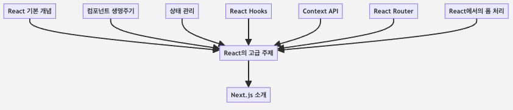

# 📘 Chapter 10. 요약 및 다음 단계

## 이 장에서 다룬 주요 개념 복습

* `사용자 인터페이스`를 구축하기 위한 강력한 `JavaScript 라이브러리`인 `React`와 관련된 `다양한 핵심 개념`

* 주요 요약
  * **`React` 기본 개념** : `컴포넌트`, `props`, `state`와 같은 `React`의 기본 개념을 탐구함.
  * **컴포넌트 `생명주기`** : 
    * `마운팅`, `업데이트`, `언마운팅 단계` 
    * 각 단계에 관련된 생명주기 메서드에 대해 알아봄.
  * **상태 관리** : `React`에서 `state`를 사용하여 동적이고 인터랙티브한 컴포넌트를 만드는 방법을 배움.
  * **`React Hooks`** : `useState`와 `useEffect`와 같은 `React Hooks`를 사용하여 함수형 컴포넌트에서 상태와 사이드 이펙트를 관리하는 방법을 알아봄.
  * **`Context API`** : `React` 애플리케이션 내에서 전역 상태를 관리하기 위한 `Context API`에 대해 살펴봄.
  * **`React Router`** : 단일 페이지 애플리케이션(`SPA`)에서의 네비게이션을 다루기 위해 `React Router`를 사용하는 방법을 살펴봄.
  * **`React에서의 폼 처리`** : 폼의 생성과 관리, 폼 상태 및 유효성 검사 처리 방법을 다룸.

## 이 장에서 배운 지식을 다음 장과 통합하기

* 지식과 기술은 `React 개발`에 견고한 기반을 제공 → 새로운 기술과 개념과 통합할 것

* **`Next.js`**
  * **`Next.js`** 는 `서버 측 렌더링`을 가능하게 해주는 `React 프레임워크`
  * `React 기반` 웹 애플리케이션에 대한 `정적 웹사이트`를 `생성`할 수 있음
  * **`Next.js`** 를 효과적으로 사용하는 방법을 이해하려면 `React`에 대한 견고한 기반이 필요

## `React`의 고급 주제와 `Next.js` 소개

