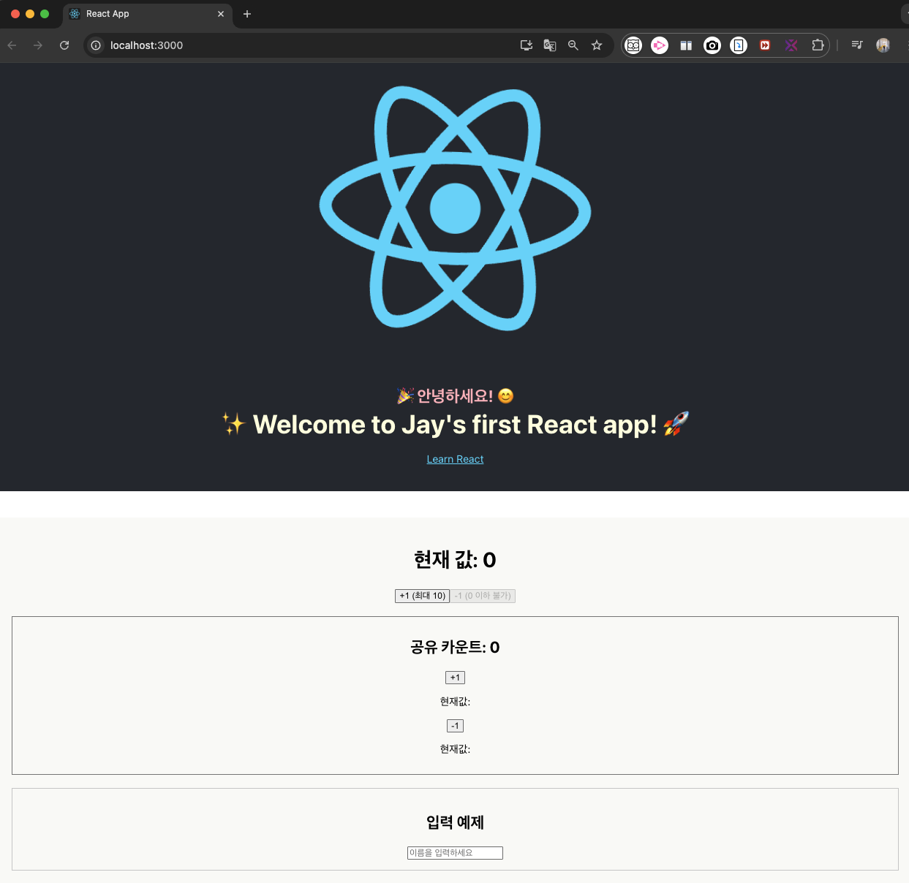

# React state 관리 실습 정리 (`../frontend/my-app/src/components/`)

## 🧪 실습 개요  

React에서의 상태 관리를 기반으로 다음 컴포넌트를 직접 구현하고 실험했다:

- `Counter`: 기본적인 count 증가/감소
- `CounterParent`: 상태 끌어올리기(Lifting State Up) 구조
- `InputExample`: 상태와 사용자 입력 처리
- `App.js`: 각 컴포넌트를 통합하여 화면에 렌더링

---

## 1️⃣ Counter 컴포넌트

| 포인트                    | 설명                                          |
|--------------------------|-----------------------------------------------|
| useState 사용             | `const [count, setCount] = useState(0)`       |
| 증가/감소 버튼 구현       | `setCount(count + 1)` / `setCount(count - 1)` |
| 조건부 버튼 비활성화      | `disabled={count >= 10}`, `disabled={count <= 0}` |
| UI 정책                  | 0 이하/10 이상으로 상태 제한 구현             |


🔹 적용 코드 예시:
```jsx
<button 
  onClick={() => { if (count < 10) setCount(count + 1); }}
  disabled={count >= 10}
>+1 (최대 10)</button>

<button
  onClick={() => { if (count > 0) setCount(count - 1); }}
  disabled={count <= 0}
>-1 (0 이하 불가)</button>
```


<br>

- 개발 서버 결과 확인_1 : `최대값 도달 시 빨간 색 경고 메세지 + 비활성화`
 
- 

<br>

- 개발 서버 결과 확인_2 : `최소값 도달 시 비활성화`

- 

<br>

## 2️⃣ CounterParent 컴포넌트

| 포인트              | 설명                                                              |
|--------------------|-------------------------------------------------------------------|
| 상태 끌어올리기      | 부모(CounterParent)가 count 상태를 소유                            |
| 자식 역할 분리       | ChildCounter는 버튼 UI + onClick 전달만 담당                         |
| props 전달 구조     | `onIncrement`, `label`, `value` 등으로 기능과 표시 분리                |


🔹 자식 컴포넌트 예시:
```jsx
function ChildCounter({ onIncrement, label, value }) {
  return (
    <div>
      <button onClick={onIncrement}>{label}</button>
      <p>현재값: {value}</p>
    </div>
  );
}
```

---

## 3️⃣ InputExample 컴포넌트

| 포인트               | 설명                                 |
|---------------------|--------------------------------------|
| 입력 상태 관리        | `const [name, setName] = useState('')` |
| 입력값 출력           | `{name && <p>환영합니다, {name}님!</p>}` |
| 실시간 동기화         | `onChange={(e) => setName(e.target.value)}` |


🔹 응용:
```jsx
<input
  type="text"
  value={name}
  onChange={(e) => setName(e.target.value)}
  placeholder="이름을 입력하세요"
/>
```

- 개발 서버 결과 확인 3
    - 개발자 페이지/console에서 확인 가능
    - `useEffect`의 목적
        - 상태 {`name`} 가 바뀔 때마다 특정 코드 (부수 효과, `side effect`)를 자동 실행
        -  `console`에 로그 남기거나 `API` 호출, 팝업 알림 등 가능
    - 이번 실습에서의 목적: **상태가 바뀔 때 자동 실행되는 구조 확인 or 디버깅용**

<br>

- 

<br>

---

## 4️⃣ App.js 통합 구조

| 구성요소      | 설명                                      |
|---------------|-------------------------------------------|
| `<header>`     | 인사 메시지, 앱 설명 등 상단 UI 구성           |
| `<main>`       | 실습 컴포넌트 (`<Counter />`, `<CounterParent />`, `<InputExample />`) 배치 |
| 스타일 조정     | `main` 영역에 `padding`, `background` 추가하여 시각적 구분 |

<br>

- 개발 서버 결과 확인 4 
  - `header` : 생성한 React App 그대로 유지
  - `main` -> `../components/` 실습 내용 렌더링 
  - `css` : 스타일 다르게 적용

- 

<br>

---

## 🌈 기타 학습 포인트

- **display: flex + gap 사용**으로 버튼 가로 정렬 UI도 실습
- `useEffect()`로 상태 변화 반응 예시 확인
- props의 명명법(`onClick` vs `onIncrement`)에 대한 이해 강화
- 상태 조건 제한, 버튼 비활성화 등 실전 구성 연습 완료

---

## ✅ 커밋 및 프로젝트 관리

| 항목            | 경로 예시                                      |
|-----------------|------------------------------------------------|
| 컴포넌트 코드     | `/frontend/my-app/src/components/`            |
| 정리 문서(md)   | `/docs/react/concepts/07_state_practice_summary.md` |
| 깃 커밋 분리     | 실습 코드(feat:), 문서 내용(docs:) 따로 커밋 완료     |
