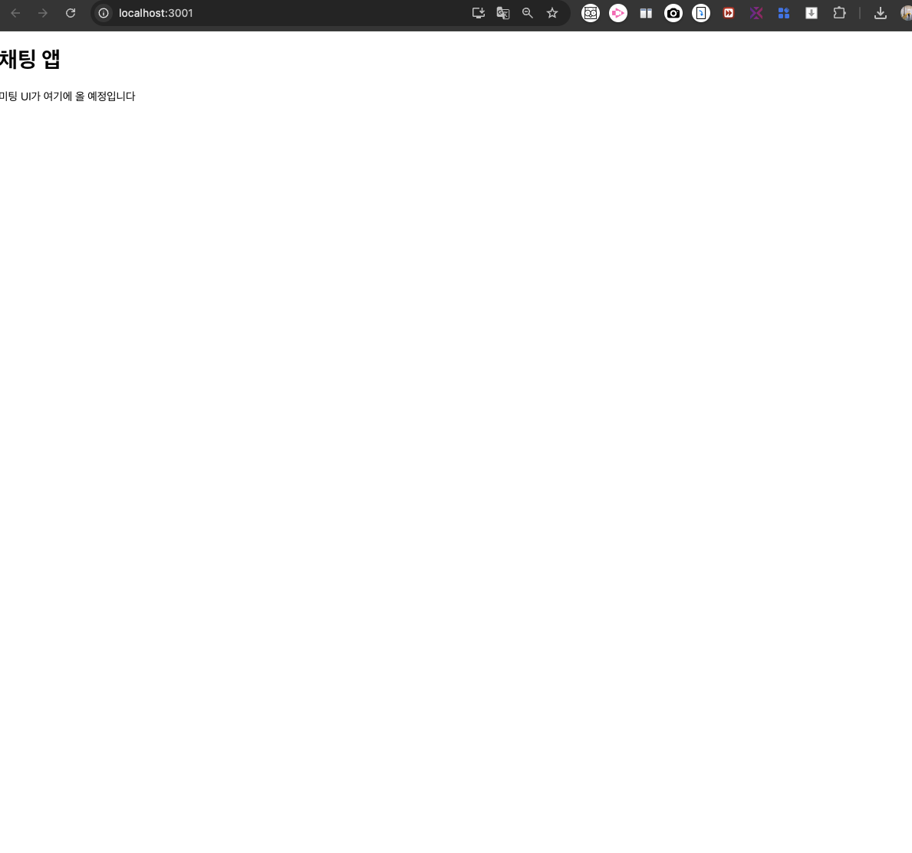
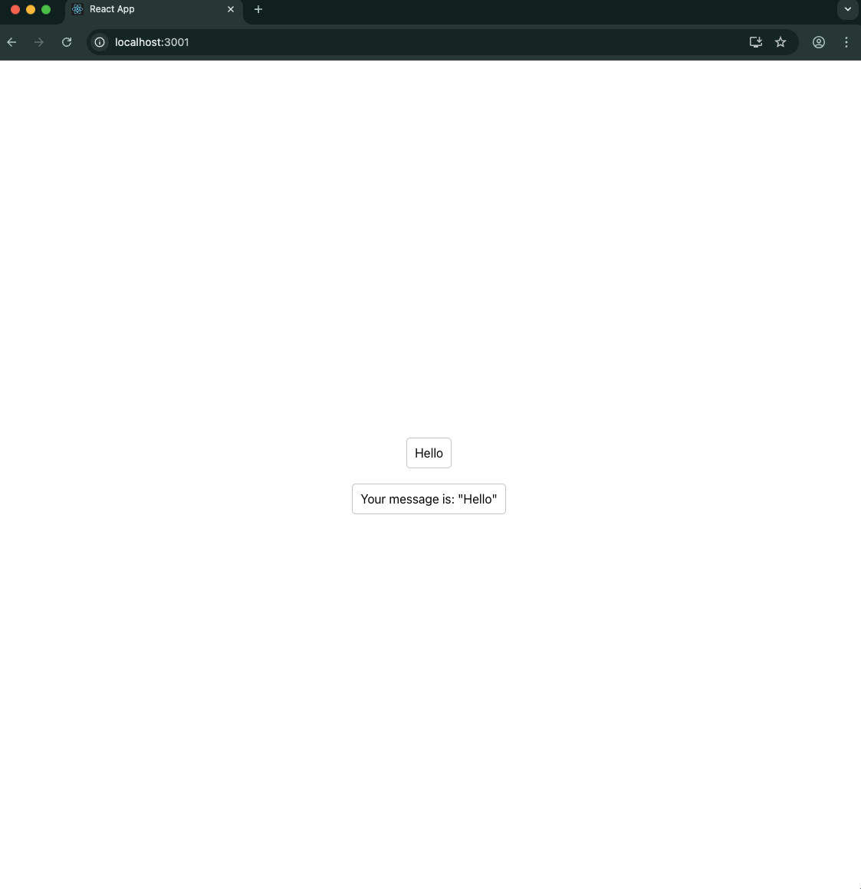
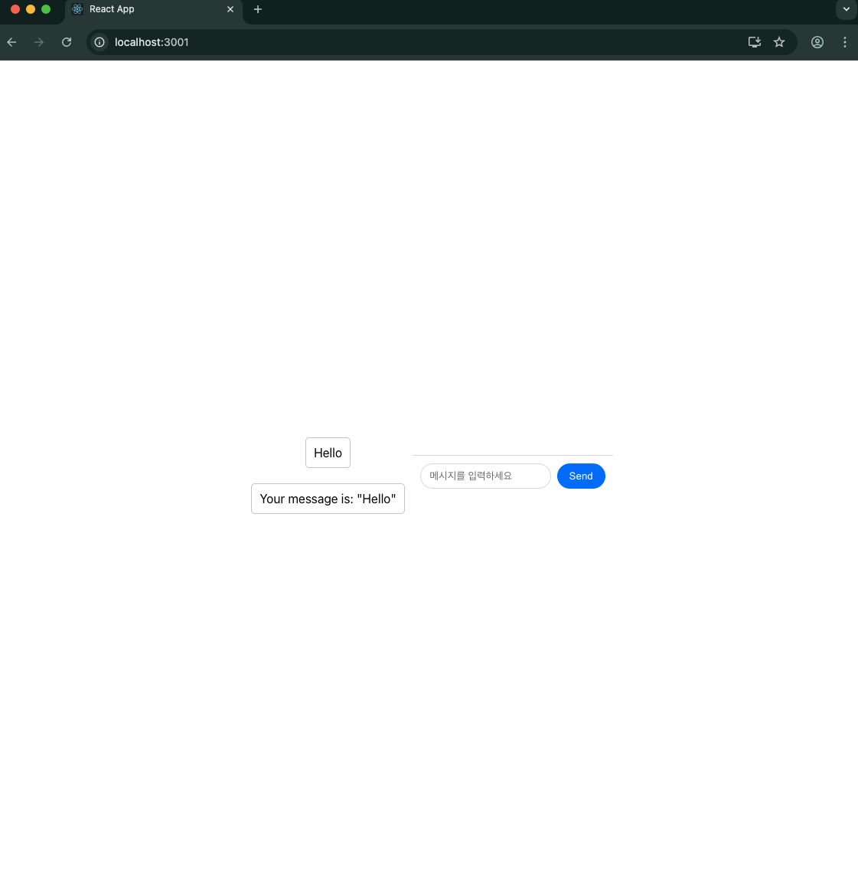
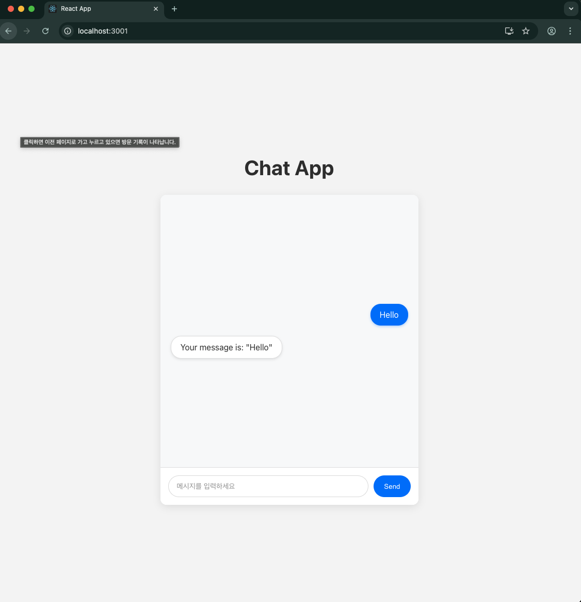

# chatbot-app 생성 및 기본 구조 잡기 
*(`../frontend/chatbot-app/src`)*

## 🧪 실습 개요  
- `my-app` = 기본 컴포넌트 (`Counter`,`Input` 등)
- `chatbot-app` = 챗봇 UI, 상태 관리, 타이핑 애니메이션 등

> 두 앱을 동시에 실행하며 차이점을 확인하고 싶음
> 
> 각각의 코드 구조를 비교하며 `React` 패턴 학습하기

---

## 폴더 위치

### 위치 및 구조
```markdown

..frontend/
    └── chatbot-app/        ← 새로 생성한 앱!
        └── src/
            ├── App.js      ← 여기에 메인 컴포넌트
            ├── App.css     ← 스타일링  
            └── index.js    ← 진입점

```

### 실행 준비

```bash
cd frontend/chatbot-app

npm start
```

### 포트 문제 해결
* `frontend/chatbot-app/` 폴더에 `.env` 파일 생성 → `git` 추적 허용

```python
PORT=3001
```
  * `포트 번호만` 들어있음
  * 민감한 정보 전혀 없음
  * 누구나 볼 수 있는 일반적인 설정

* 다시 실행
```bash
cd frontend/chatbot-app

npm start
```

  * `localhost:3000` → `my-app` (기존 Counter, Input 등)
  * `localhost:3001` → `chatbot-app` (새로운 챗봇 UI)

---

## 기본 구조 잡기

### step_1

- 기본 구조만 잡아보기: `App.js`

    ```jsx

    // frontend/chatbot-app/src/App.js
    import React from 'react';
    import './App.css';

    function App() {
    return (
        <div className="app">
        <h1>Chat App</h1>
        <div className="chat-box">
            <p>채팅 UI가 여기에 올 예정입니다</p>
        </div>
        </div>
    );
    }

    export default App;

    ```

- 

### step_2

- 정적 메시지 표시 해보기: `chat-box` 부분 수정

    ```jsx
    <div className="chat-box">
    <div className="messages-list">
        <div className="user-message">Hello</div>
        <div className="ai-message">Your message is: "Hello"</div>
    </div>
    </div>

    ```

- 결과물이 마음에 들지 않음
  
    ```markdown
    - 가독성이 나쁨
      - `inline style`로 임시 수정
        - `style` 속성: `flex` 속성 직접 추가 → 중앙 정렬
        - `height`: '100vh'로 화면 전체 높이에 맞춰서 요소들을 중앙에 배치
        - 각 메시지 박스에도 `margin`, `padding` 등을 직접 설정
    
    **↓**

    ```

- 가독성 개정 버전
  
  ```jsx    

    <div className="chat-box" style={{ display: 'flex', justifyContent: 'center', alignItems: 'center', height: '100vh' }}>
      <div className="messages-list" style={{ display: 'flex', flexDirection: 'column', alignItems: 'center' }}>
        <div className="user-message" style={{ margin: '10px', padding: '10px', backgroundColor: '#fff', border: '1px solid #ccc', borderRadius: '5px' }}>
          Hello
        </div>
        <div className="ai-message" style={{ margin: '10px', padding: '10px', backgroundColor: '#fff', border: '1px solid #ccc', borderRadius: '5px' }}>
          Your message is: "Hello"
        </div>
      </div>
    </div>

  ```
- 

### step_3
- 입력 폼 추가하기: `chat-box` 부분에 추가

    ```jsx

    // frontend/chatbot-app/src/App.js
    <div className="chat-box">
    <div className="messages-list">
        <div className="user-message">Hello</div>
        <div className="ai-message">Your message is: "Hello"</div>
    </div>
    
    {/* 👇 새로 추가할 부분 */}
    <form className="message-form">
        <input 
        type="text" 
        className="message-input" 
        placeholder="메시지를 입력하세요"
        />
        <button type="submit">Send</button>
    </form>
    </div>

    ```

- css 추가하기: `App.css`
  
  ```css

  .message-form {
    display: flex;
    padding: 10px;
    border-top: 1px solid #ddd;
    background: white;
    }

    .message-input {
    flex: 1;
    padding: 8px 12px;
    border: 1px solid #ddd;
    border-radius: 20px;
    outline: none;
    margin-right: 8px;
    }

    .message-input:focus {
    border-color: #007bff;
    }

    button[type="submit"] {
    padding: 8px 16px;
    background: #007bff;
    color: white;
    border: none;
    border-radius: 20px;
    cursor: pointer;
    }

    button[type="submit"]:hover {
    background: #0056b3;
    }

  ```

- 테스트 목표
  - 입력창이 아래쪽에 예쁘게 표시
  - `Send` 버튼이 `옆에 파란색`으로 표시
  - 입력창에 포커스하면 테두리 색 변경
  - 전체적으로 `깔끔한 챗봇 UI` 완성



### step_4

- 현재 상태 확인
  - ✅ Step 1: `기본 구조` 완료
  - ✅ Step 2: `정적 메시지` 표시 완료
  - ✅ Step 3: `입력 폼 추가` 완료
 
- ✅ Jay의 보너스: 가운데 정렬 `스타일링`
  - 스크린샷에서 보이는 것:
    - 📱 `Hello` 사용자 메시지
    - 🤖 `Your message is: Hello` AI 응답
    - 💬 `메시지를 입력하세요` 입력창
    - 🔵 `Send` 파란색 버튼


- **최종 스타일링 정리**
  - `App.js`의 스타일링 부분 → `App.css`로 분리

- `App.js` (최종)

    ```jsx

    // frontend/chatbot-app/src/App.js
    import React from 'react';
    import './App.css';

    function App() {
    return (
        <div className="app">
        <h1>Chat App</h1>
        <div className="chat-box">
            <div className="messages-list">
            <div className="user-message">Hello</div>
            <div className="ai-message">Your message is: "Hello"</div>
            </div>
            <form className="message-form">
            <input 
                type="text" 
                className="message-input" 
                placeholder="메시지를 입력하세요"
            />
            <button type="submit">Send</button>
            </form>
        </div>
        </div>
    );
    }

    export default App;

    ```

- `App.css` (최종)

    ```css

    /* frontend/chatbot-app/src/App.css */

    /* 전체 앱 스타일 */
    .app {
    text-align: center;
    background-color: #f5f5f5;
    min-height: 100vh;
    display: flex;
    flex-direction: column;
    justify-content: center;
    align-items: center;
    }

    .app h1 {
    color: #333;
    margin-bottom: 30px;
    font-size: 2.5rem;
    }

    /* 채팅 박스 전체 */
    .chat-box {
    display: flex;
    flex-direction: column;
    width: 500px;
    height: 600px;
    background: white;
    border-radius: 12px;
    box-shadow: 0 4px 15px rgba(0, 0, 0, 0.1);
    overflow: hidden;
    }

    /* 메시지 리스트 영역 */
    .messages-list {
    flex: 1;
    padding: 20px;
    display: flex;
    flex-direction: column;
    justify-content: center;
    align-items: center;
    overflow-y: auto;
    background: #f8f9fa;
    }

    /* 사용자 메시지 */
    .user-message {
    background: #007bff;
    color: white;
    padding: 12px 18px;
    margin: 10px 0;
    border-radius: 20px;
    max-width: 80%;
    align-self: flex-end;
    box-shadow: 0 2px 5px rgba(0, 123, 255, 0.3);
    }

    /* AI 메시지 */
    .ai-message {
    background: white;
    color: #333;
    padding: 12px 18px;
    margin: 10px 0;
    border: 1px solid #e0e0e0;
    border-radius: 20px;
    max-width: 80%;
    align-self: flex-start;
    box-shadow: 0 2px 5px rgba(0, 0, 0, 0.1);
    }

    /* 입력 폼 영역 */
    .message-form {
    display: flex;
    padding: 15px;
    background: white;
    border-top: 1px solid #e0e0e0;
    }

    /* 입력창 */
    .message-input {
    flex: 1;
    padding: 12px 16px;
    border: 1px solid #ddd;
    border-radius: 25px;
    outline: none;
    margin-right: 10px;
    font-size: 14px;
    }

    .message-input:focus {
    border-color: #007bff;
    box-shadow: 0 0 0 3px rgba(0, 123, 255, 0.1);
    }

    .message-input::placeholder {
    color: #999;
    }

    /* 전송 버튼 */
    button[type="submit"] {
    padding: 12px 20px;
    background: #007bff;
    color: white;
    border: none;
    border-radius: 25px;
    cursor: pointer;
    font-weight: 500;
    transition: all 0.3s ease;
    }

    button[type="submit"]:hover {
    background: #0056b3;
    transform: translateY(-1px);
    box-shadow: 0 4px 8px rgba(0, 123, 255, 0.3);
    }

    button[type="submit"]:active {
    transform: translateY(0);
    }

    /* 반응형 디자인 */
    @media (max-width: 600px) {
    .chat-box {
        width: 90vw;
        height: 80vh;
    }
    
    .app h1 {
        font-size: 2rem;
    }
    }

    ```

- 개선된 부분들
  - 
  - 인라인 스타일 → `CSS 클래스`로 완전 분리
  - 그림자 효과 추가로 더 입체적
  - `hover` 애니메이션 효과 추가
  - `반응형` 디자인 모바일 대응
  - `컬러 팔레트 통일성 있게` 정리