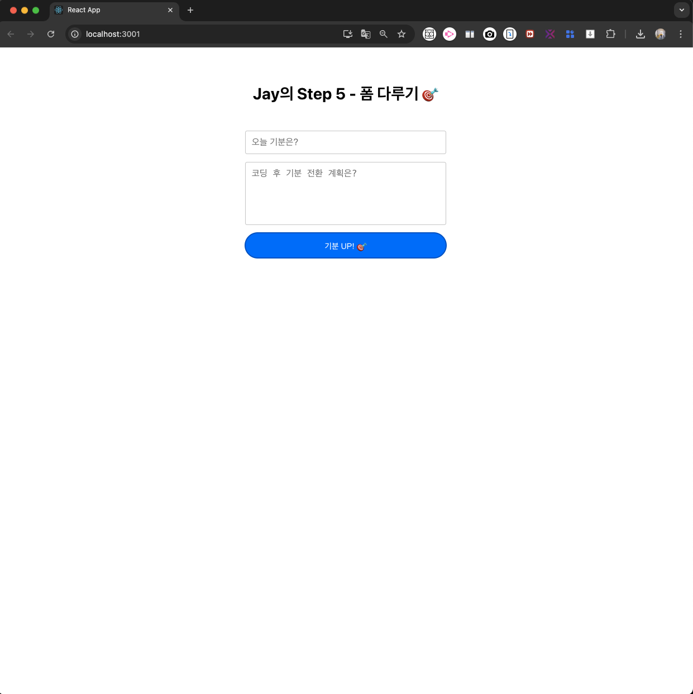
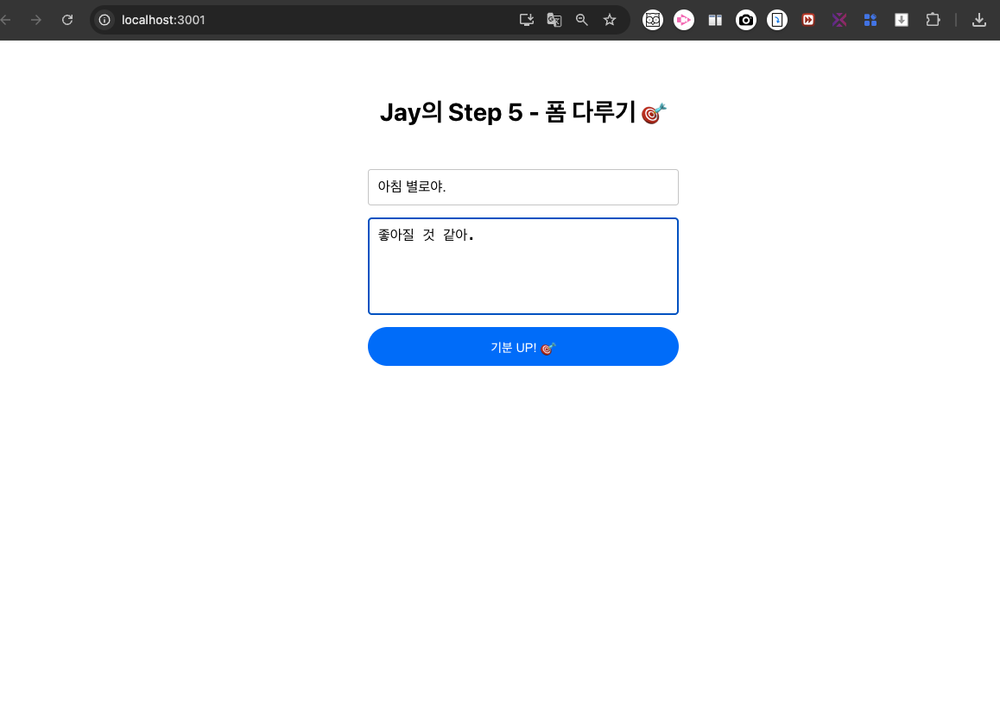
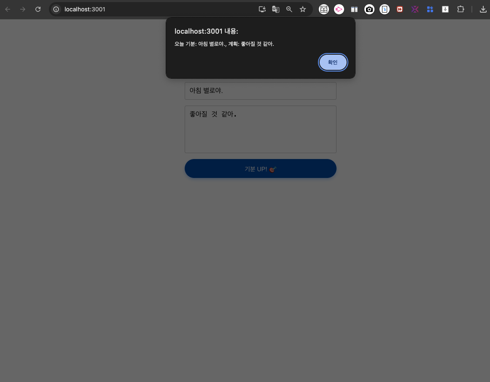
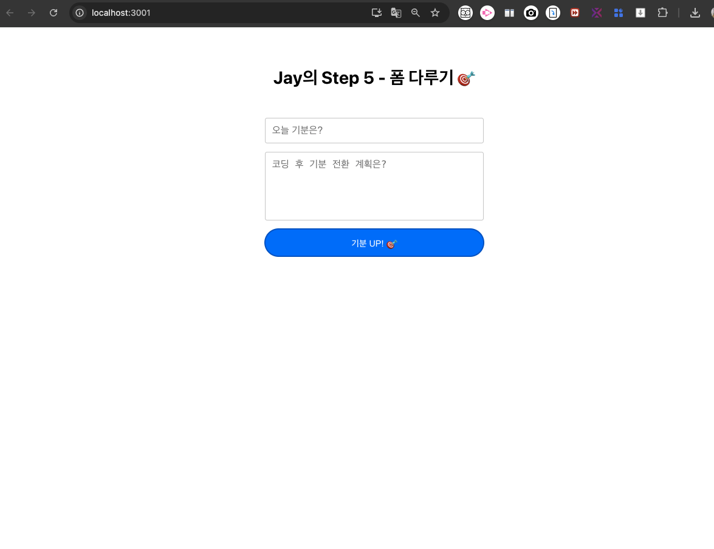

# 📝 Step 5 - 폼 데이터 다루기 

> 2025-08-21
>
> Jay

## 📁 파일 구조
```markdown

..frontend/
    └── chatbot-app/ 
        └── src/
            ├── App.js                  ← 메인 컴포넌트
            ├── App.css                 ← 메인 스타일링
            ├── StressReliefForm.js     ← 오늘 생성한 컴포넌트 (폼 컴포넌트)
            ├── StressReliefForm.css    ← 폼 컴포넌트 css
            └── index.js                ← 진입점

```

## ✅ 구현 항목

- [✓] 폼 컴포넌트 (`input`, `textarea`) 분리 및 작성
- [✓] `useState`로 상태 관리 (`mood`, `plan`)
- [✓] `onChange`, `onSubmit` 등 이벤트 핸들링
- [✓] 제출 시 `alert`로 데이터 **확인 + 입력값 리셋**
- [✓] `App.css`: `flex`, `중앙 정렬` 등 스타일 적용
- [✓] 반응형 웹을 위한 구조 설계

## 💡 주요 코드

* 1) `App.js`, `App.css` 변경 사항
  
    ```jsx
    // App.js 中
    <div className="App">
    <h1>Jay의 Step 5 - 폼 다루기 🎯</h1>
    <StressReliefForm />
    </div>
    ```

    ```css
    /* App.css */
    .App {
    display: flex;
    flex-direction: column;
    align-items: center;
    margin-top: 50px;
    }
    ```
- 
  - 제목 가운데 위치
  - 내용 입력
    - 아침: 20%
    - Step5 완료 후: 만족감 + 기분 UP!

- 
  - 입력 후 화면
  - `alert` → 상태 확인 가능

<br>

* 2) 새로 작성한 `js`, `css` 파일의 코드

    ```jsx

    import React, { useState } from 'react';
    import './StressRelirefForm.css';                            // 스타일 파일 불러오기

    // StressReliefForm 컴포넌트 정의
    const StressReliefForm = () => {
        // 상태(state) 정의: 기분과 계획을 각각 상태로 관리
        const [mood, setMood] = useState('');
        const [plan, setPlan] = useState('');

        // 폼 제출 시 실행되는 함수
        const handleSubmit = (e) => {
            e.preventDefault();                                 // 폼 기본 동작(페이지 새로고침) 방지
            alert(`오늘 기분: ${mood}, 계획: ${plan}`);            // 입력된 값 알림창으로 출력
            setMood('');                                        // 입력 필드 초기화
            setPlan('');
        };

        return (
            // 폼 요소 정의 및 제출 이벤트 처리
            <form className="stress-relief-form" onSubmit={handleSubmit}>
                {/* 기분 입력 필드 */}
                <input 
                type="text"
                placeholder="오늘 기분은?"                              // 입력 안내 텍스트
                value={mood}                                        // 상태 mood와 연결
                onChange={(e) => setMood(e.target.value)}           // 입력값 변경 시 상태 업데이트
                className="input-field"                             // CSS 클래스 지정
                />
            
                {/* 계획 입력 텍스트 영역 */}
                <textarea 
                placeholder="코딩 후 기분 전환 계획은?"                       // 입력 안내 텍스트
                value={plan} // 상태 plan과 연결
                onChange={(e) => setPlan(e.target.value)}               // 입력값 변경 시 상태 업데이트
                className="textarea-field"                              // CSS 클래스 지정
                />

                {/* 제출 버튼 */}
                <button type="submit" className="submit-button">
                기분 UP! 🎯
                </button>
            </form>
        );
    };

    export default StressReliefForm;                                    // 컴포넌트 내보내기

    ```

    ```css

    /* 폼 전체를 감싸는 컨테이너 스타일 */
    .stress-relief-form {
    display: flex;                                /* 자식 요소들을 플렉스 박스로 배치 */
    flex-direction: column;                       /* 세로 방향으로 정렬 */
    width: 90%;                                   /* 모바일에서는 90% */
    max-width: 400px;                             /* 최대 크기 제한 */
    width: 300px;                                 /* 폼의 너비를 300px로 고정 */
    margin: 0 auto;                                /* 수평 가운데 정렬 (자동 마진) */
    }

    /* 텍스트 입력 필드 스타일 (기분 입력) */
    .input-field {
    padding: 12px;                                /* 안쪽 여백을 10px로 지정 */
    margin-bottom: 15px;                          /* 아래쪽에 여백 추가 (다음 요소와 간격) */
    border: 1px solid #ccc;                     /* 테두리를 연한 회색으로 지정 */
    border-radius: 4px;                           /* 테두리 둥글게 만들기 */
    font-size: 16px;                              /* 글자 크기 설정 */
    }

    /* 텍스트 영역 스타일 (계획 입력) */
    .textarea-field {
    padding: 12px;                                /* 안쪽 여백 */
    height: 100px;                                /* 높이를 100px로 고정 */
    border: 1px solid #ccc;                     /* 테두리를 연한 회색으로 지정 */
    border-radius: 4px;                           /* 테두리 둥글게 만들기 */
    font-size: 16px;                              /* 글자 크기 설정 */
    resize: none;                                 /* 사용자가 크기 조절 못하게 제한 */
    margin-bottom: 15px;                          /* 아래쪽 여백 */
    }

    /* 태블릿 이상 */
    @media (min-width: 768px) {
        .stress-relief-form {
            width: 400px;
            padding: 30px;
        }

        .input-field, .textarea-field {
            font-size: 18px;
        }
    }

    /* 데스크탑 */
    @media (min-width: 1024px) {
        .stress-relief-form {
            width: 500px;
        }
    }


    /* 제출 버튼 스타일 */
    .submit-button {
    background-color: #007bff;                  /* 배경색: 파란색 계열 */
    color: white;                               /* 글자색: 흰색 */
    padding: 10px;                                /* 안쪽 여백 */
    border: none;                                 /* 테두리 제거 */
    border-radius: 4px;                           /* 둥근 테두리 */
    font-size: 16px;                              /* 글자 크기 */
    cursor: pointer;                              /* 마우스를 올렸을 때 커서 모양 변경 (클릭 가능 표시) */
    }

    /* 버튼에 마우스를 올렸을 때의 스타일 */
    .submit-button:hover {
    background-color: #0056b3;                  /* hover: 더 진한 파란색으로 변경 */
    }

    ```


## 📝 오늘의 거둔 것

- 리액트 `폼 state`/`이벤트`/`제출 전 과정` 익힘
- `styled-components`나 `모듈화 구조`로 발전 가능성 발견
- 작은 기능부터 분리 ~ 적용까지 성장 경험

### 실습 결과 화면

- `step5` 첫 화면
  - 

- `stet5` 입력 + `submit`
  - 

- 이후 **초기화**
  - 

--- 

*🚀 다음 계획: 전체 컴포넌트 분리 및 App 네비게이션 구조 정비(23일 이후)*
