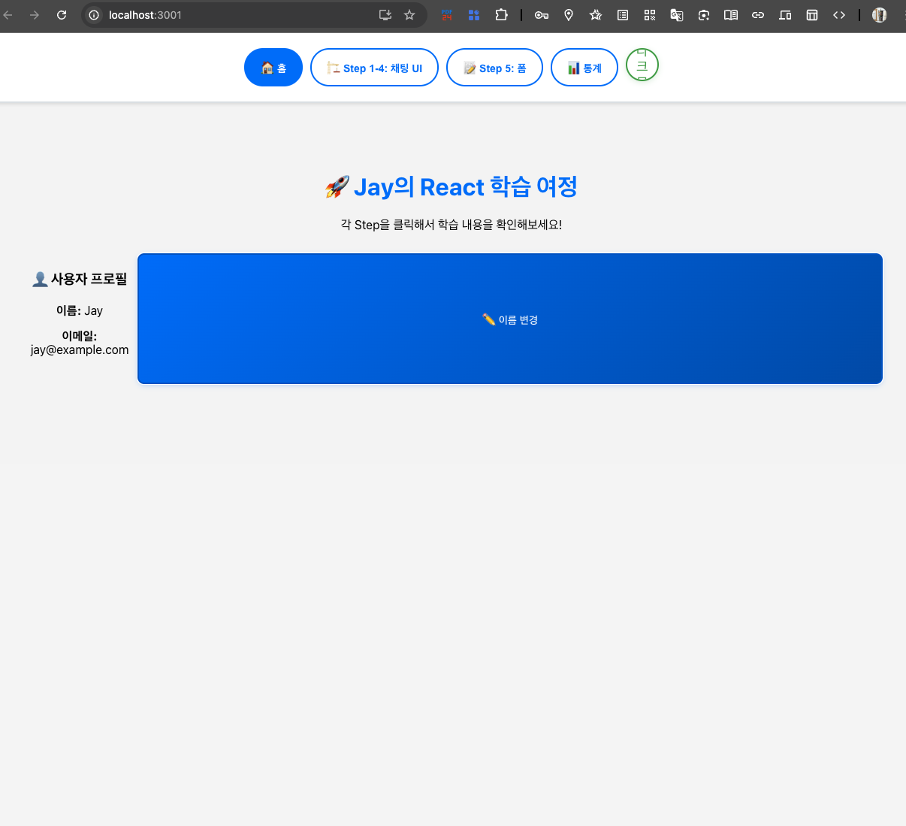
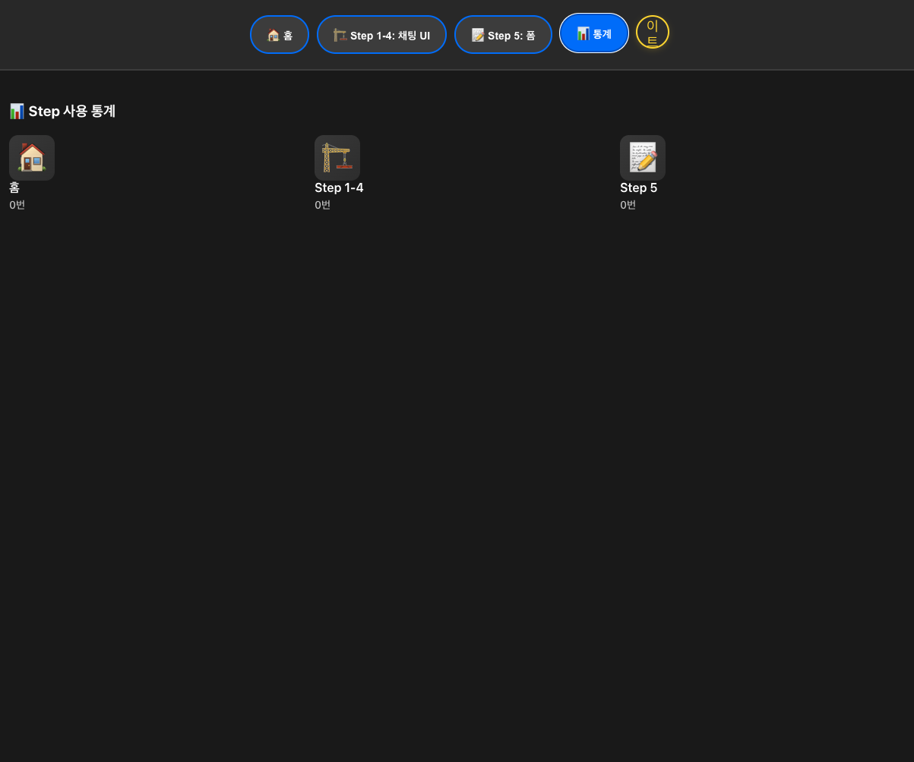
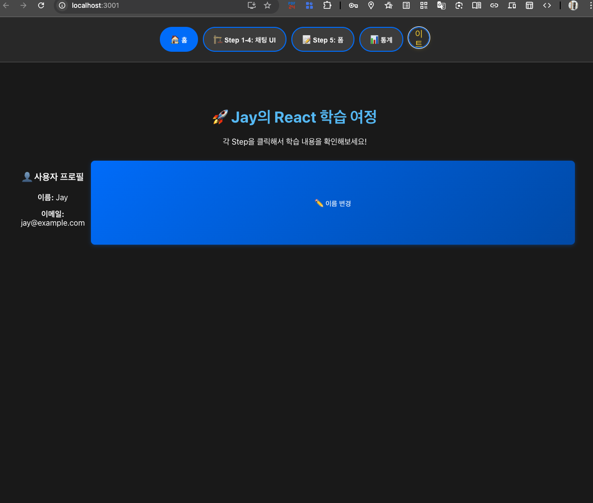

# 🚀 **Step 6: 고급 상태 관리 & 컴포넌트 통신**

## **🎯 Step 6에서 배울 핵심 개념**

### **📚 기본 개념 쉬운 설명**

#### **1️⃣ 상태(State)란 뭘까?**
- **지금까지**: 각 컴포넌트가 **자기만의 상태** 관리 (useState)
- **Step 6에서**: **여러 컴포넌트가 상태를 공유**하는 방법 배우기
- **예시**: "로그인한 사용자 정보"를 모든 컴포넌트에서 사용하고 싶을 때

#### **2️⃣ 왜 고급 상태 관리가 필요할까?**
```
현재 상황:
• Step1-4 컴포넌트 → 자기만의 카운터 상태 ❌
• Step5 컴포넌트 → 자기만의 폼 상태 ❌
→ 서로 데이터 공유 불가능 😢

※ Step 6 목표:
• 모든 컴포넌트가 → 공통 상태 공유 ✅
• 사용자 정보, 테마 설정 등을 모든 곳에서 사용 😊
```

***

## **🔧 Step 6 실습 흐름**

### **📝 1단계: Context API 기초**
- **React Context**: 전역 상태 저장소 만들기
- **Provider**: 상태를 제공하는 컴포넌트
- **useContext**: 상태를 사용하는 Hook

### **📝 2단계: 사용자 프로필 전역 관리**
- **사용자 이름, 테마 색상** 등을 모든 컴포넌트에서 공유
- **Step 1-4, Step 5에서 동일한 사용자 정보** 표시

### **📝 3단계: 다크모드 토글 기능**
- **라이트/다크 테마 전환** 버튼
- **모든 페이지에 테마 적용**

### **📝 4단계: 통계 대시보드**
- **각 Step별 사용 횟수** 추적
- **전체 앱 사용 통계** 표시

***

## **💻 Step 6 코드 구현**

### **1️⃣ contexts/AppContext.js (전역 상태 저장소)**
```jsx
// src/contexts/AppContext.js
import React, { createContext, useContext, useState } from 'react';

// 1. Context 생성 (전역 상태 저장소 만들기)
const AppContext = createContext();

// 2. Provider 컴포넌트 (상태를 제공하는 역할)
export const AppProvider = ({ children }) => {
  // 전역으로 관리할 상태들
  const [user, setUser] = useState({
    name: 'Jay', // 사용자 이름
    email: 'jay@example.com' // 사용자 이메일
  });

  const [theme, setTheme] = useState('light'); // 테마 (light/dark)
  
  const [stepStats, setStepStats] = useState({
    'step1-4': 0, // Step 1-4 사용 횟수
    'step5': 0,   // Step 5 사용 횟수
    'home': 0     // 홈 방문 횟수
  });

  // 테마 변경 함수
  const toggleTheme = () => {
    setTheme(prevTheme => prevTheme === 'light' ? 'dark' : 'light');
  };

  // Step 사용 횟수 증가 함수
  const incrementStepCount = (stepName) => {
    setStepStats(prev => ({
      ...prev, // 기존 상태 유지 (spread 문법)
      [stepName]: prev[stepName] + 1 // 해당 Step만 +1
    }));
  };

  // 사용자 정보 업데이트 함수
  const updateUser = (newUserInfo) => {
    setUser(prev => ({ ...prev, ...newUserInfo }));
  };

  // 모든 컴포넌트에서 사용할 값들
  const contextValue = {
    // 상태 값들
    user,
    theme, 
    stepStats,
    // 상태 변경 함수들
    updateUser,
    toggleTheme,
    incrementStepCount
  };

  return (
    // Provider로 감싸서 하위 컴포넌트들이 상태를 사용할 수 있게 함
    <AppContext.Provider value={contextValue}>
      {children}
    </AppContext.Provider>
  );
};

// 3. Context를 쉽게 사용할 수 있는 커스텀 Hook
export const useAppContext = () => {
  const context = useContext(AppContext);
  if (!context) {
    throw new Error('useAppContext는 AppProvider 내부에서만 사용 가능합니다!');
  }
  return context;
};
```

### **2️⃣ components/UserProfile.js (사용자 프로필)**
```javascript
// src/components/UserProfile.js
import React from 'react';
import { useAppContext } from '../contexts/AppContext';
import './UserProfile.css';

const UserProfile = () => {
  // 전역 상태에서 사용자 정보 가져오기
  const { user, updateUser } = useAppContext();

  // 사용자 이름 변경 함수
  const handleNameChange = () => {
    const newName = prompt('새로운 이름을 입력하세요:', user.name);
    if (newName) {
      updateUser({ name: newName }); // 전역 상태 업데이트
    }
  };

  return (
    <div className="user-profile">
      <div className="profile-info">
        <h3>👤 사용자 프로필</h3>
        <p><strong>이름:</strong> {user.name}</p>
        <p><strong>이메일:</strong> {user.email}</p>
      </div>
      <button onClick={handleNameChange} className="edit-button">
        ✏️ 이름 변경
      </button>
    </div>
  );
};

export default UserProfile;
```

### **3️⃣ components/ThemeToggle.js (테마 변경 버튼)**
```javascript
// src/components/ThemeToggle.js
import React from 'react';
import { useAppContext } from '../contexts/AppContext';
import './ThemeToggle.css';

const ThemeToggle = () => {
  // 전역 상태에서 테마 정보 가져오기
  const { theme, toggleTheme } = useAppContext();

  return (
    <button 
      onClick={toggleTheme} 
      className={`theme-toggle ${theme}`}
    >
      {theme === 'light' ? '🌙 다크모드' : '☀️ 라이트모드'}
    </button>
  );
};

export default ThemeToggle;
```

### **4️⃣ components/StepStats.js (사용 통계)**
```jsx
// src/components/StepStats.js  
import React from 'react';
import { useAppContext } from '../contexts/AppContext';
import './StepStats.css';

const StepStats = () => {
  // 전역 상태에서 통계 정보 가져오기
  const { stepStats } = useAppContext();

  return (
    <div className="step-stats">
      <h3>📊 Step 사용 통계</h3>
      <div className="stats-grid">
        <div className="stat-item">
          <span className="stat-icon">🏠</span>
          <span className="stat-label">홈</span>
          <span className="stat-count">{stepStats.home}번</span>
        </div>
        <div className="stat-item">
          <span className="stat-icon">🏗️</span>
          <span className="stat-label">Step 1-4</span>
          <span className="stat-count">{stepStats['step1-4']}번</span>
        </div>
        <div className="stat-item">
          <span className="stat-icon">📝</span>
          <span className="stat-label">Step 5</span>
          <span className="stat-count">{stepStats.step5}번</span>
        </div>
      </div>
    </div>
  );
};

export default StepStats;
```

### **5️⃣ App.js 업데이트 (Context 적용)**
```jsx
// src/App.js
import React, { useState, useEffect } from 'react';
import './App.css';
import { AppProvider, useAppContext } from './contexts/AppContext';
import Step1to4 from './components/Step1to4';
import StressReliefForm from './components/StressReliefForm';
import UserProfile from './components/UserProfile';
import ThemeToggle from './components/ThemeToggle';
import StepStats from './components/StepStats';

// 실제 App 컴포넌트 (Context를 사용하는 부분)
const AppContent = () => {
  const [currentStep, setCurrentStep] = useState('home');
  
  // 전역 상태 사용하기
  const { theme, incrementStepCount, user } = useAppContext();

  // Step 변경 시 통계 업데이트
  const handleStepChange = (stepName) => {
    setCurrentStep(stepName);
    incrementStepCount(stepName); // 사용 횟수 증가
  };

  // 테마에 따른 CSS 클래스 적용
  useEffect(() => {
    document.body.className = theme; // body에 테마 클래스 추가
  }, [theme]);

  const renderStepContent = () => {
    switch(currentStep) {
      case 'step1-4':
        return <Step1to4 />;
      case 'step5':
        return (
          <div>
            <h2>📝 Step 5: 폼 데이터 다루기</h2>
            <StressReliefForm />
          </div>
        );
      case 'stats':
        return <StepStats />;
      default:
        return (
          <div className="home-content">
            <h1>🚀 {user.name}의 React 학습 여정</h1>
            <p>각 Step을 클릭해서 학습 내용을 확인해보세요!</p>
            <UserProfile />
          </div>
        );
    }
  };

  return (
    <div className={`App ${theme}`}>
      <nav className="step-navigation">
        <button 
          onClick={() => handleStepChange('home')}
          className={currentStep === 'home' ? 'active' : ''}
        >
          🏠 홈
        </button>
        <button 
          onClick={() => handleStepChange('step1-4')}
          className={currentStep === 'step1-4' ? 'active' : ''}
        >
          🏗️ Step 1-4: 채팅 UI
        </button>
        <button 
          onClick={() => handleStepChange('step5')}
          className={currentStep === 'step5' ? 'active' : ''}
        >
          📝 Step 5: 폼 다루기
        </button>
        <button 
          onClick={() => handleStepChange('stats')}
          className={currentStep === 'stats' ? 'active' : ''}
        >
          📊 통계
        </button>
        <ThemeToggle />
      </nav>
      
      <main className="step-content">
        {renderStepContent()}
      </main>
    </div>
  );
};

// 메인 App 컴포넌트 (Provider로 감싸기)
function App() {
  return (
    <AppProvider>
      <AppContent />
    </AppProvider>
  );
}

export default App;
```

***

## **🎨 Step 6 CSS 스타일 (다크모드 지원)**

### **App.css 다크모드 추가**
```css
/* src/App.css에 추가 */

/* 라이트 테마 (기본) */
.App.light {
  background-color: #f5f5f5;
  color: #333;
  min-height: 100vh;
  transition: all 0.3s ease; /* 부드러운 전환 효과 */
}

/* 다크 테마 */
.App.dark {
  background-color: #1a1a1a;
  color: #ffffff;
  min-height: 100vh;
  transition: all 0.3s ease;
}

/* 다크모드 네비게이션 */
.App.dark .step-navigation {
  background-color: #2d2d2d;
  border-bottom-color: #444;
}

.App.dark .step-navigation button {
  background-color: #444;
  color: #fff;
  border-color: #007bff;
}

/* 테마 토글 버튼 */
.theme-toggle {
  padding: 8px 16px;
  border: none;
  border-radius: 20px;
  cursor: pointer;
  font-size: 14px;
  transition: all 0.3s ease;
  margin-left: 10px;
}

.theme-toggle.light {
  background-color: #333;
  color: #fff;
}

.theme-toggle.dark {
  background-color: #ffd700;
  color: #333;
}
```

***

## **🏆 Step 6 완료 후 얻는 것들**

1. **전역 상태 관리** 완전 이해 ✅
2. **Context API** 활용 능력 ✅  
3. **다크모드** 구현 스킬 ✅
4. **컴포넌트 간 통신** 마스터 ✅
5. **실무급 React 앱** 구조 완성 ✅


***

## `Step6` 

> 3개의 파일(`StepStats.js` + `ThemeToggle.js` + `UserProfile.js`)
>
> 1개의 폴더(`contexts`) + 하위 파일 1개 (`AppContext`)

***

### **폴더 구조**

-
```markdown
.../src/
    ├── components/
    │   ├── Step1to4.js 
    │   ├── Step1to4.css 
    │   ├── Step5.js
    │   ├── Step5.css
    │   ├── `StepStats.js`            ✅ (새로 생성)
    │   ├── `ThemeToggle.js`          ✅ (새로 생성)
    │   └── `UserProfile.js`          ✅ (새로 생성)
    ├── `contexts/`                   ✅ (새로 생성)
    │   └── `AppContext.js`           ✅ (새로 생성)
    ├── App.js
    └── App.css
```

## **step6에서 구현할 기능**

- **UserProfile.js** = Step 6의 사용자 프로필 기능
- **ThemeToggle.js** = Step 6의 다크모드 기능  
- **StepStats.js** = Step 6의 통계 기능
- **AppContext.js** = Step 6의 전역 상태 관리

### 🔧 Step 6 **≠ 컴포넌트** **= 시스템**
- **Step 1-4**: 채팅 UI 컴포넌트
- **Step 5**: 폼 컴포넌트  
- **Step 6**: **전역 상태 관리 + 여러 기능들의 조합**

***

## **진행 단계**

### **1️⃣ 각 컴포넌트의 CSS 파일들 생성**

- 
    ```markdown
    UserProfile.css (필요)
    ThemeToggle.css (필요)  
    StepStats.css (필요)
    ```

### **2️⃣ App.js 업데이트**
- `Context Provider` 적용
- `새로운 컴포넌트`들 `import`
- `네비게이션`에 통계 `버튼 추가`

### **3️⃣ App.css에 다크모드 스타일 추가**

# 실습 결과

## 📊 Dashboard 같은 개념
- `UserProfile` 컴포넌트
  - 

<br>

- `StepStats` 통계 대시보드
  - 

<br>

- `ThemeToggle` (`Light` or `Dark` 모드)
  - 다크모드 선택
  - 

<br>

- 실시간 상태 변경
  - 테마 토글, 통계 업데이트
  - 
  
<br>

## Django의 Admin과 비슷하다고 느낀 부분

### 🔧 핵심 기능들
- `Django Admin`
  - 모델 데이터 관리, 사용자 권한, 통계
  - 관리자 관점: `내 웹앱의 모든 데이터를 한곳에서 관리`

- `React` Step 6: 
  - 컴포넌트 상태 관리, 사용자 프로필, 학습 통계
  - 관리자 관점: `내 학습 앱의 모든 상태를 한곳에서 관리`

  - 
  ```markdown

  Django Admin              →      React Step 6
    ├── 사용자 관리                    ├── UserProfile 컴포넌트  
    ├── 모델별 통계                    ├── StepStats 통계 대시보드
    ├── 테마 커스터마이징                ├── ThemeToggle (Light/Dark)
    └── 관리 인터페이스                 └── 네비게이션 + 전역 상태

  ```

- `Django` `≒` `React`
  - **전역 상태 관리** ≒ `Django`의 `데이터베이스` 개념
  - **Context API** ≒ `Django`의 `admin 권한 시스템`
  - **컴포넌트 통신** ≒ `Django`의 `모델 간 관계`
  - **통계 대시보드** ≒ `Django` `admin`의 `통계 페이지`
  
***

  - 
  ```markdown
  Django Admin    ≒     React Step 6
    ├── 백엔드 관리             ├── 프론트엔드 상태 관리
    ├── 데이터 CRUD            ├── 컴포넌트 상태 변경  
    ├── 사용자 세션             ├── Context 전역 상태
    └── 관리 대시보드            └── 통계 + 프로필 대시보드

  ```

### `React`에서 더 발전된 점들
- 1️⃣ 실시간 상호작용
  - `Django Admin`: 페이지 새로고침 필요
  - `React` Step 6: `실시간` 상태 변경 (테마 토글, 통계 업데이트)
- 2️⃣ 사용자 경험
  - `Django Admin`: `관리자용` (기능 중심)
  - `React` Step 6: `일반 사용자용` (`UX 중심`)
- 3️⃣ 반응성
  - `Django Admin`: `서버 요청` `→` `응답`
  - `React` Step 6: `클라이언트 상태` `→` `즉시 반영`

### 