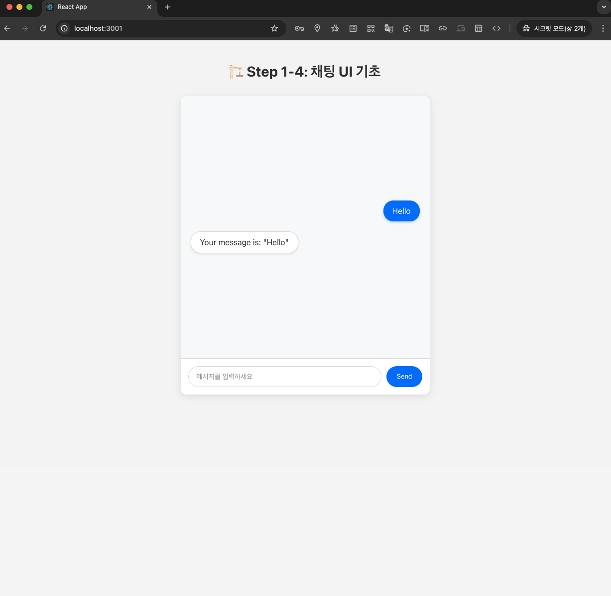
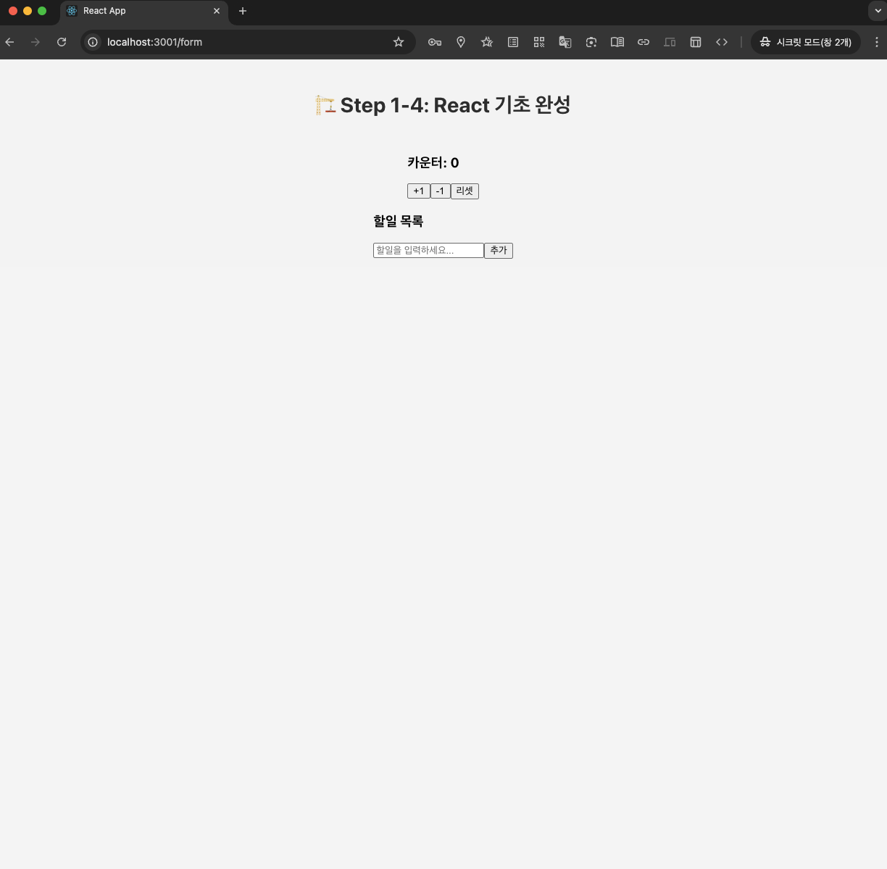
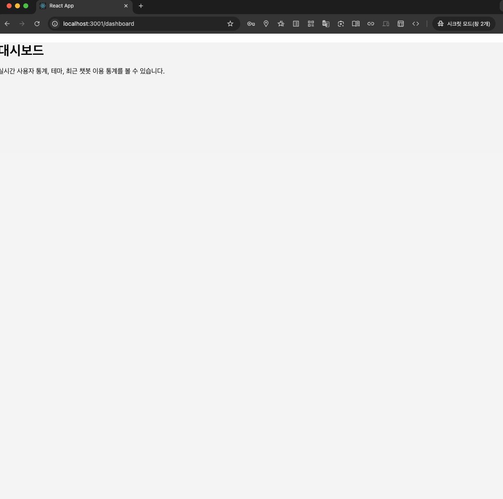

# 🚦 Step 7: Basic Routing & Page Management in `React`

## 1. Overview

> 
> 참고: [트러블슈팅의 기록](../troubleshooting/React_white_screen_and_Invalid_Hook_call_troubleshooting.md)
>
> 트러블슈팅에서 `많은 실수`, `오류`, `롤백`, `복구` 등을 거치며 새로운 기능 추가보다 **`Step1to4`, `Step5`, `Step6` → 기본으로 활용하고자 함**
>
> `React Router DOM v6`를 활용해 페이지 **라우팅과 관리 기능** 을 **`basic`으로** 구현해보는 것을 목표로 함

- 메인 페이지, 폼, 대시보드 등 **여러 페이지를 동시 관리**
- `Route 컴포넌트`로 `URL별 렌더링` 컴포넌트 지정
- `BrowserRouter`를 `최상위`에 배치해 `SPA 라우팅` 지원

## 2. 주요 구성 파일

### 2-1. `index.js`

```jsx
import React from 'react';
import ReactDOM from 'react-dom/client';
import './index.css';
import App from './App';
import { AppProvider } from './contexts/AppContext';
import { BrowserRouter } from 'react-router-dom';

const root = ReactDOM.createRoot(document.getElementById('root'));
root.render(
  <React.StrictMode>
    <AppProvider>
      <BrowserRouter>
        <App />
      </BrowserRouter>
    </AppProvider>
  </React.StrictMode>
);
```

### 2-2. `App.js`

```jsx
import React, { useEffect } from 'react';
import './App.css';
import { useAppContext } from './contexts/AppContext';
import { Routes, Route } from 'react-router-dom';
import Step1to4 from './components/Step1to4';
import Step5 from './components/Step5';
import Dashboard from './components/Dashboard';

const App = () => {
  const { theme } = useAppContext();

  useEffect(() => {
    console.log('테마 적용 중:', theme);
  }, [theme]);

  return (
    <div className={`App ${theme}`}>
      <Routes>
        <Route path="/" element={<Step1to4 />} />
        <Route path="/form" element={<Step5 />} />
        <Route path="/dashboard" element={<Dashboard />} />
      </Routes>
    </div>
  );
};

export default App;
```

## 3. 결과

- `npm start` 후 `localhost:3001` 접속
  - *같은 프로젝트 내 다른 React앱과의 `localhost 충돌을 막기 위해 3001`으로 `사전 설정해둠`*
  - *기본적으로 `localhost:3000`이 정상*

- `/`, `/form`, `/dashboard`로 페이지 이동 확인 = 모든 페이지 성공적으로 **돔 라우팅 확인**
  - `/` = `Step1to4`
  - 


  - `/form` = `Step5`
  - 

  - `/dashboard` = `Step6`
  - 

***

*next: Step7_advanced 도전 예정* 