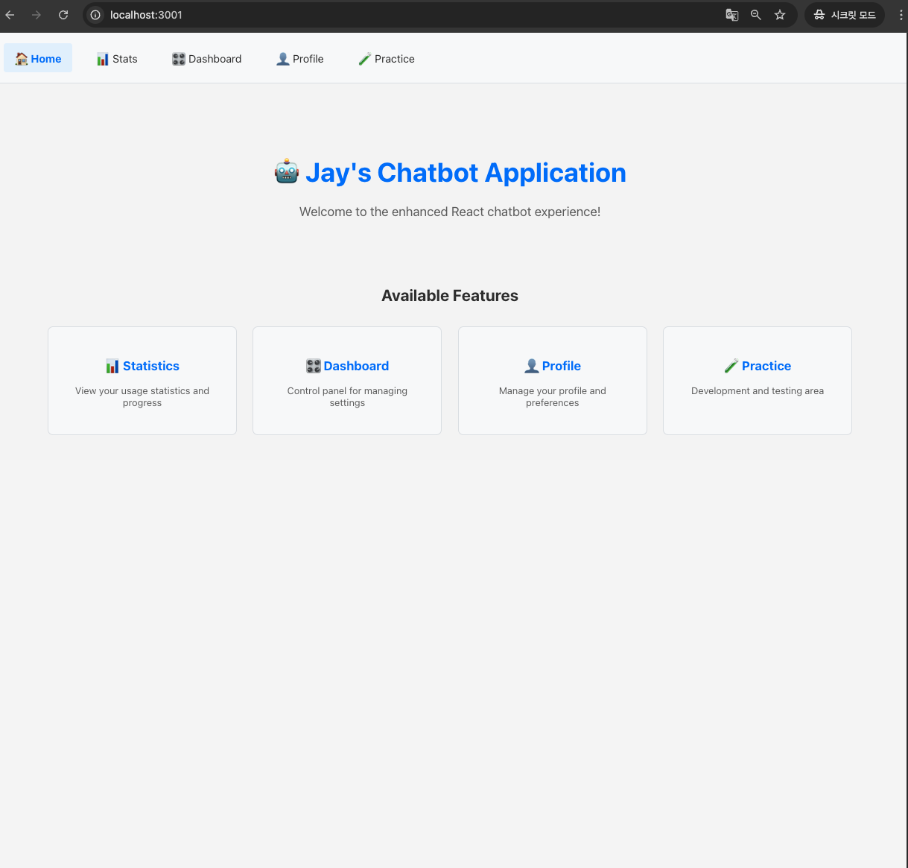
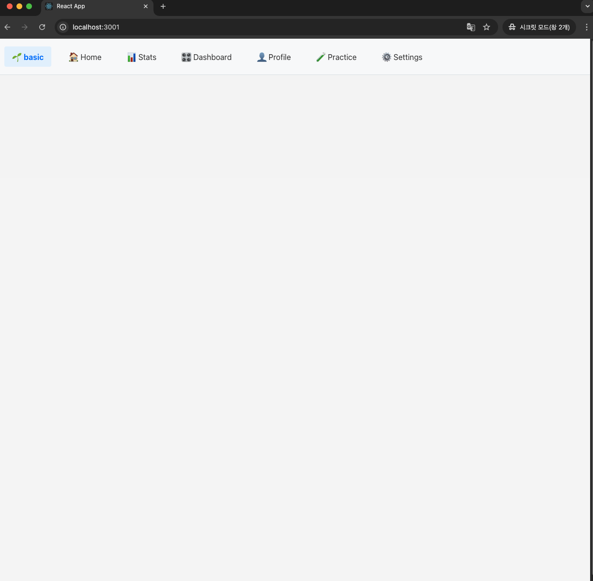
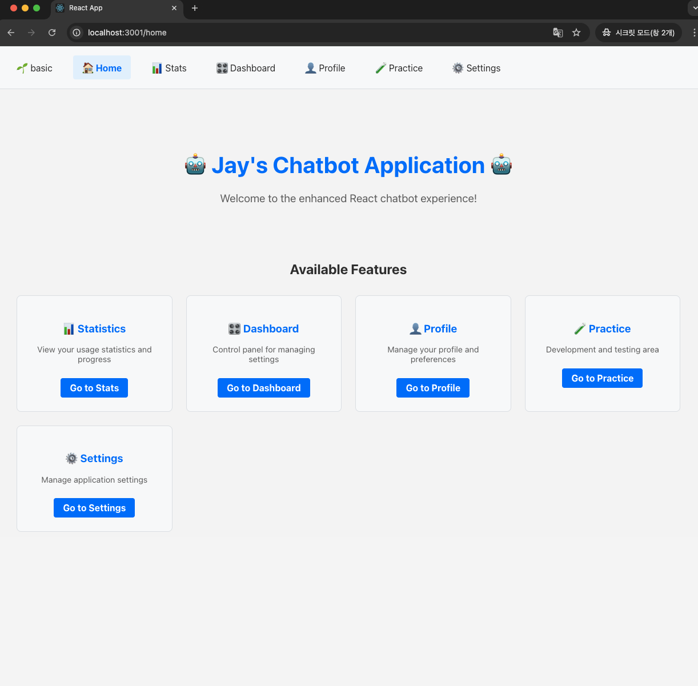
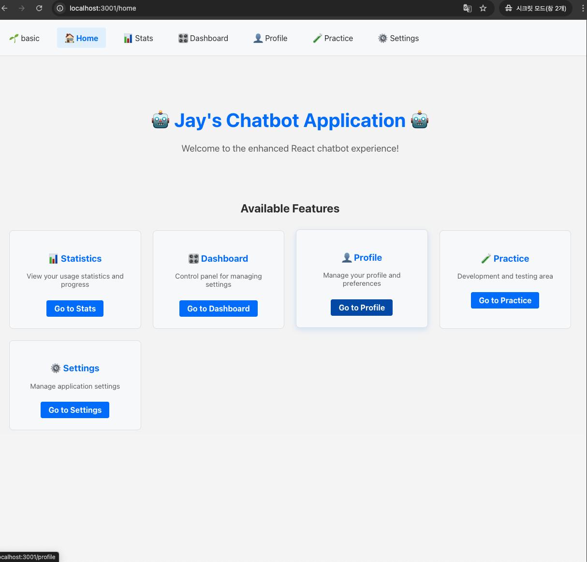
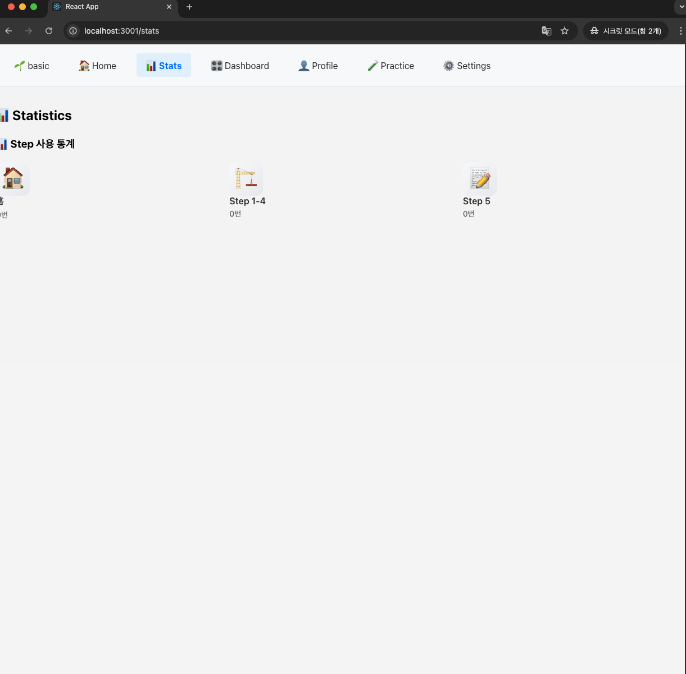
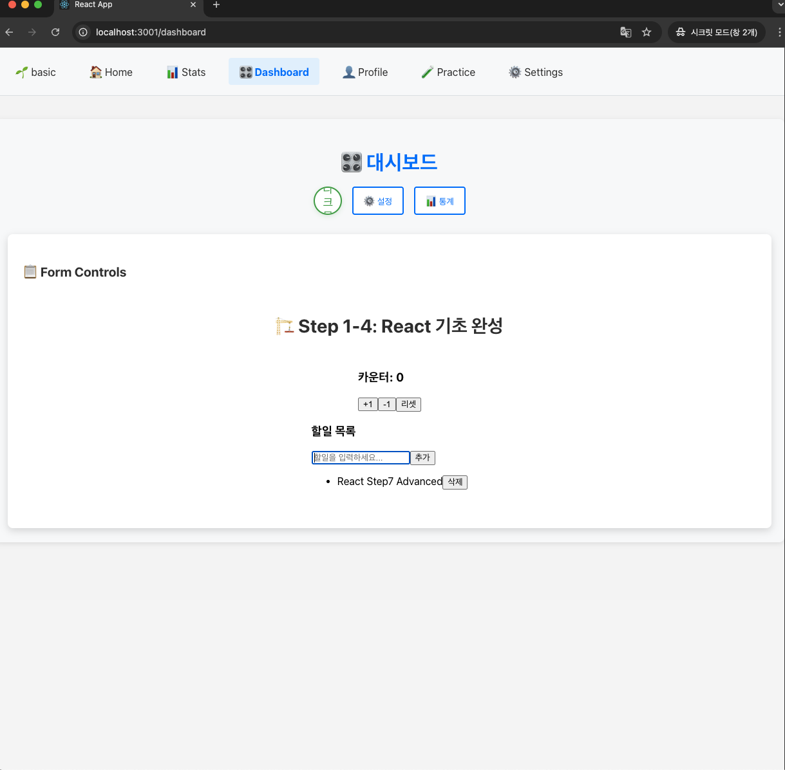
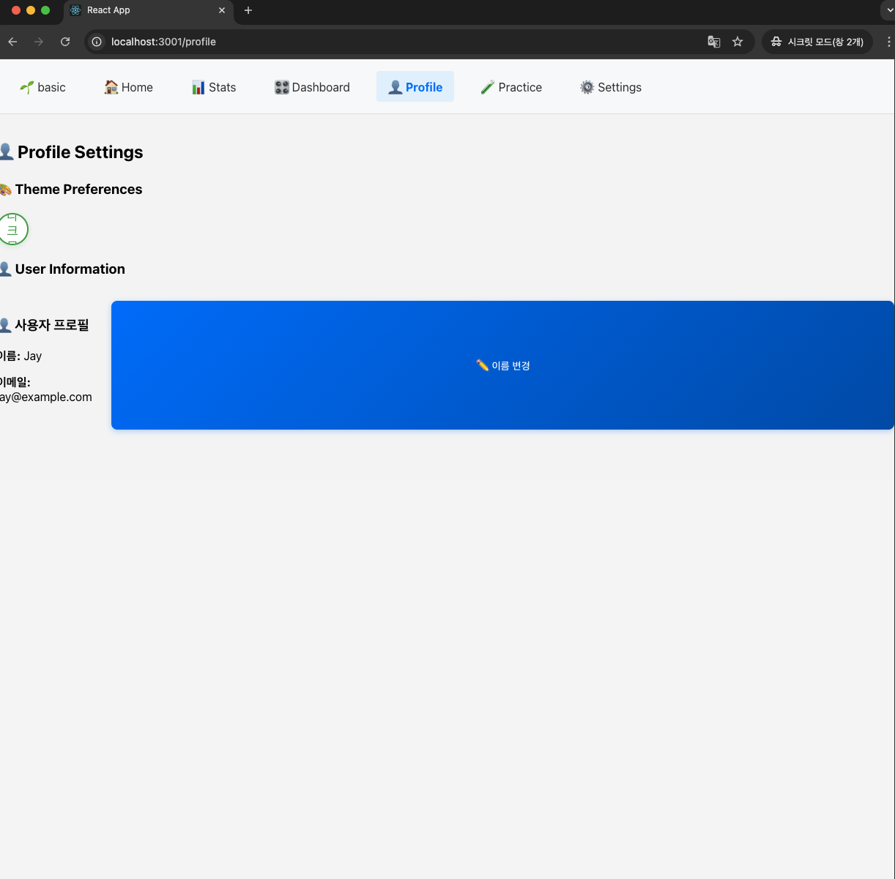
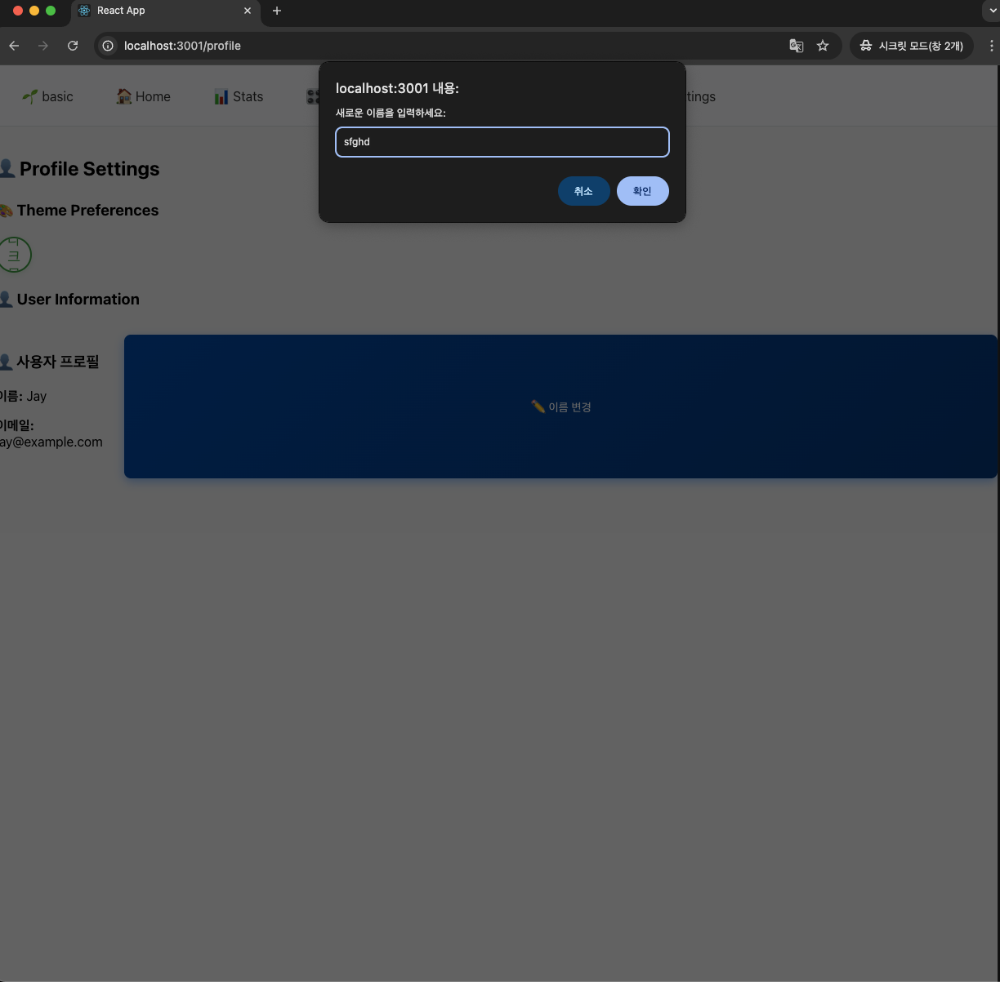
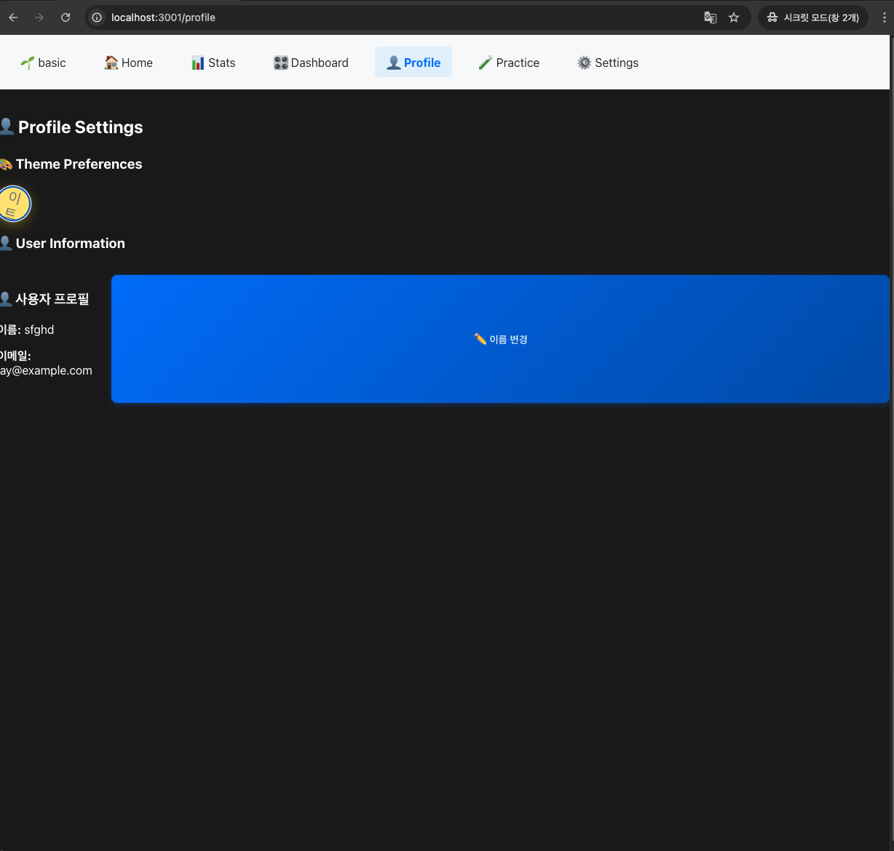
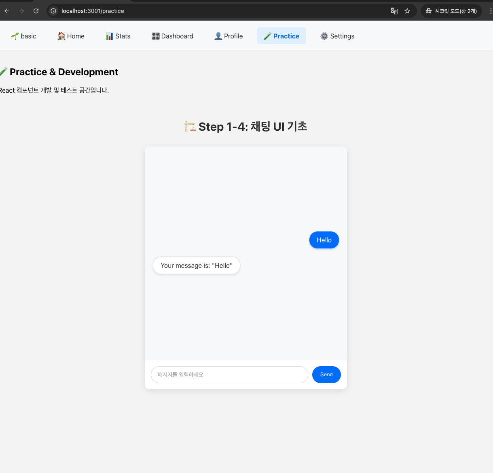

# 🔍 **`Step7-basic` vs `Step7-advanced`** - 차이점

## **📊 `Step7_basic`**

### **✅ 기존 페이지 라우팅:**
* 
    ```jsx
    // 지난번 App.js
    <Routes>
    <Route path="/" element={<Step1to4 />} />           // 이미 완성된 컴포넌트
    <Route path="/form" element={<Step5 />} />          // 이미 완성된 컴포넌트  
    <Route path="/dashboard" element={<Dashboard />} /> // 이미 완성된 컴포넌트
    </Routes>
    ```

**특징:**
- ✅ **완성된 기능들**을 URL로 연결만 함
- ✅ **기존 컴포넌트 그대로 활용** (`Step1to4`, `Step5`, `Step6`)
- ✅ **라우팅 성공**: 3개 페이지 모두 정상 작동

## **🚀 `Step7_advanced`**

### **💡 새로운 웹사이트 구조 만들기:**
* 
    ```jsx
    // App.js의 Routes 구성
    <Routes>
      <Route path="/" element={<Home />} />                 // 랜딩 페이지
      <Route path="/practice" element={<Practice />} />     // Step1to4 연습
      <Route path="/stats" element={<Stats />} />           // 통계 보기
      <Route path="/profile" element={<Profile />} />       // 프로필 관리
      <Route path="/dashboard" element={<Dashboard />} />   // 제어판
    </Routes>
    ```

**특징:**
- 🆕 **새로운 페이지 컴포넌트들** 생성
- 🔗 **기존 기능들을 새 페이지에 배치**
- 🎨 **통합된 웹사이트** 완성

<br>

---

<br>

# 🧩 **기존 컴포넌트 활용 방법 - 구체적 예시**

## **📋 현재 자산들:**
* 
    ```markdown
    이미 가지고 있는 것들:
    🎯 Step1to4: `버튼`, `상태관리`, `기본 기능들`
    🎯 Step5: `폼` 처리 (`FormHandler`, `입력값 검증`)  
    🎯 Step6: `API 연동` (`UserProfile`, `StepStats`, `ThemeToggle`)
    🎯 `AppContext: 전역 상태 관리
    🎯 각종 CSS 스타일들
    ```

## **🔄 활용 방법 - 실제 코드로 보기**

### **`🏠 Home.js` (메인 랜딩 페이지):**
* 
```jsx
import React from "react";
import { Link } from "react-router-dom";

const Home = () => (
  <div className="home-container">
    <header className="hero-section">
      <h1>🤖 Jay's Chatbot Application</h1>
      <p>AI 기반 스마트 챗봇으로 더 나은 경험을 만나보세요</p>
    </header>
    
    <section className="features">
      <h2>주요 기능</h2>
      <div className="feature-grid">
        <div className="feature-card">
          <h3>📊 실시간 통계</h3>
          <p>사용 패턴과 성과를 한눈에</p>
          <Link to="/stats">통계 보기</Link>
        </div>
        
        <div className="feature-card">
          <h3>🎛️ 제어판</h3>
          <p>설정과 관리를 편리하게</p>
          <Link to="/dashboard">대시보드 이동</Link>
        </div>
        
        <div className="feature-card">
          <h3>👤 프로필</h3>
          <p>개인 정보와 테마 설정</p>
          <Link to="/profile">프로필 보기</Link>
        </div>
      </div>
    </section>
  </div>
);

export default Home;
```

### **`🛠️ Practice.js` (연습 페이지 분리):**
* 
```jsx
import React from "react";
import Step1to4 from "./Step1to4";  // 기존 연습 컴포넌트

const Practice = () => (
  <div>
    <h2>🧪 개발 연습 페이지</h2>
    <p>챗봇 UI 컴포넌트 개발 및 테스트 공간</p>
    
    {/* 기존 Step1to4 연습 내용 */}
    <Step1to4 />
  </div>
);

export default Practice;
```

### **`📊 Stats.js` (통계 페이지):**
* 
```jsx
import React from "react";
import StepStats from "./StepStats";

const Stats = () => (
  <div>
    <h2>📊 사용 통계</h2>
    <p>챗봇 사용 현황과 성과를 확인하세요</p>
    
    {/* Step6에서 만든 통계 컴포넌트 */}
    <StepStats />
  </div>
);
```

### **`🎛️ Dashboard.js` (대시보드):**
* 
```jsx
import React from "react";
import FormHandler from "./FormHandler";  // Step5의 폼 기능

const Dashboard = () => (
  <div>
    <h2>🎛️ 제어판</h2>
    <p>시스템 설정과 관리 기능</p>
    
    {/* Step5에서 만든 폼 처리 기능 */}
    <FormHandler />
  </div>
);
```

<br>

---

<br>

# 🎯 **핵심 개념: "리조직(Reorganization)"**

## **🔧 무엇을 하는 거야?**
* 
    ```markdown
    지난번: 기존 방들을 복도로 연결 (A방 → B방 → C방)
    이번: 기존 가구들을 새로운 방 배치로 재조합

    예시:
    - `Step6`의 `StepStats` → `Stats 페이지`에 `배치`
    - `Step6`의 `UserProfile` → `Profile 페이지`에 `배치`  
    - `Step5`의 `FormHandler` → `Dashboard 페이지`에 `배치`
    - `Step1to4`의 기능들 → `Pratice 페이지`에 배치
    ```

## **💡 왜 이렇게 하는 거야?**
1. **🎨 더 직관적인 웹사이트**: 사용자가 이해하기 쉬운 페이지 구조
2. **🔗 통합성**: 흩어진 기능들을 논리적으로 그룹화
3. **📱 실제 웹사이트 느낌**: `Practice`, `Profile`, `Stats` 같은 일반적인 구조
4. **🚀 확장성**: 나중에 기능 추가하기 쉬움

<br>

---

<br>

# 🗂️ **수정된 라우팅 구조**

## **📋 완벽한 페이지 구성:**

| 경로 | 컴포넌트 | 역할 | 포함 기존 기능 |
|------|----------|------|----------------|
| `/` | `🌱basic`버튼 | 빈 페이지 | 없음 (순수 홈) |
| `home`| **Home** | 랜딩 페이지 | 모든 페이지 연결 버튼 |
| `/practice` | **Practice** | 개발 연습 공간 | `Step1to4` |
| `/stats` | **Stats** | 사용 통계 | `StepStats` |
| `/profile` | **Profile** | 사용자 정보 | `UserProfile`, `ThemeToggle` |
| `/dashboard` | **Dashboard** | 관리 제어판 | `FormHandler` (`Step5`) |

* 기능 
  - 🏠 **Home**: 방문자를 위한 멋진 랜딩 페이지
  - 🧪 **Practice**: 개발자(Jay)를 위한 실험 공간
  - 📊 **Stats/Profile/Dashboard**: 실제 기능 페이지들


## **🎨 NavBar 구성:**
* 
```jsx
const NavBar = () => (
    <nav className={"nav-bar"}>                             {/* 테마 클래스 적용 */}
        <NavLink to="/">🌱 basic</NavLink>                   {/* 기본 페이지 */}
        <NavLink to="/home">🏠 Home</NavLink>               {/* 랜딩 페이지 */}
        <NavLink to="/stats">📊 Stats</NavLink>             {/* Step1to4 */}
        <NavLink to="/dashboard">🎛️ Dashboard</NavLink>     {/* 통계 보기 */}
        <NavLink to="/profile">👤 Profile</NavLink>         {/* 프로필 관리 */}
        <NavLink to="/practice">🧪 Practice</NavLink>       {/* 제어판 */}
        <NavLink to="/settings">⚙️ Settings</NavLink>        {/* 새로 추가 */}
    </nav>
);
```
* 기능
  - **`Home.js`**: **웰컴 메시지, 기능 소개, 다른 페이지 링크 (`순수 랜딩 페이지`)**
  - **`Practice.js`**: `Step1to4` 연습용 컴포넌트 `배치`

* `css` 생성 여부
  
  - 생성 필요
    - **`NavBar.css`** - `메뉴 스타일링`, `active 상태`, `반응형 처리`
    - **`Home.css`** - `랜딩 페이지 hero 섹션`, `feature-grid`, `카드 레이아웃`
    - **`Dashboard.css`** - `대시보드 그리드`, `위젯 배치`, `컨트롤 패널 스타일`
    - **`Settings.css`**
  
  - 생성 불필요
    - **`Practice.js`, `Stats.js`, `Profile.js`** - **기존 컴포넌트의 `CSS`를 그대로 활용**


<br>

---

<br>

# **📋 정리표**

## **🆚 지난번 vs 이번 비교**

| 구분 | 지난번 (`Step7_basic`) | 이번 (`Step7_advanced`) |
|------|---------------------|----------------------|
| **목적** | 기존 페이지들 URL 연결 | **새로운 웹사이트 구조** 생성 |
| **방법** | 완성된 컴포넌트 그대로 라우팅 | 기존 컴포넌트들을 `새 페이지`에 재배치 |
| **페이지** | `/`, `/form`, `/dashboard` | `/`, `/stats`, `/profile`, `/dashboard` |
| **NavBar** | 없음 | 모든 페이지 공통 메뉴 |
| **기존 컴포넌트** | **그대로 사용** | **import해서 새 페이지에 배치** |
| **결과** | 3개 독립적 페이지 | **통합된 하나의 웹사이트** |

<br>

## **🛠️ 작업 순서**

| 단계 | 작업 | 방법 | 예상 시간 | CSS 필요 여부 |
|------|------|------|-----------|---------------|
| **1** | `NavBar 컴포넌트` 생성 | 메뉴 링크들 만들기 | 15분 | **예** |
| **2** | `Home.js` 만들기 | **랜딩 페이지용 순수 컴포넌트 생성** | 10분 | **예** |
| **3** | `Practice.js` 만들기 | **Step1to4 컴포넌트 import 및 배치** | 10분 | 아니오 |
| **4** | `Stats.js` 만들기 | StepStats 컴포넌트 import 및 배치 | 10분 | 아니오 |
| **5** | `Profile.js` 만들기 | UserProfile 컴포넌트 import 및 배치 | 10분 | 아니오 |
| **6** | `Dashboard.js` 수정 | 여러 기능 조합 및 배치 | 15분 | **예** |
| **7** | `App.js` 라우팅 설정 | **새 컴포넌트들로 라우팅 구성** | 10분 | 아니오 |
| **8** | `테스트 & 스타일링` | 동작 확인 및 `CSS 꾸미기` | 20분 | 아니오 |


### 결과

* `NavBar`
  * 초기 네비게이션바
  * 
  ---
  * 완성된 네비게이션 바
  * 
  
* `Home`
  * 
    ---
  * 홈 화면 버튼의 호버 효과 및 네비게이션
  * 
  
* `Stat`
  * 
  
* `Dashboard`
  * 
  
* `Profile`
  * 
    ---
  * 이름 바꾸기
  * 
    ---
  * 바꾼 이름 적용 완료
  * 
  ---
  * 다크 테마 바꾸기
  * 

* `Practice`
  * 
  
* `Settings`
  * 