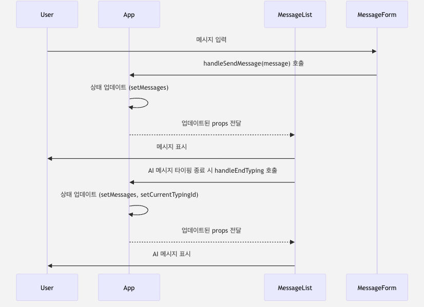
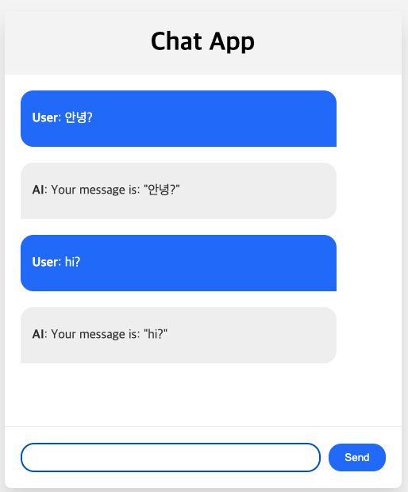

# React_Hook_1

## **설계: 시퀀스 다이어그램**



### 사용자가 메시지를 보낼 때의 이벤트 순서

> 1) 사용자가 **`MessageForm`** 컴포넌트에서 **메시지 입력**
> 
> 2) `MessageForm`은 `App 컴포넌트`에서 **`handleSendMessage 함수 호출` + `사용자의 메시지 전달`**
> 
> 3) `App` = `messages` 상태 업데이트 → **`사용자의 메시지` + `isTyping = true`인 새로운 `AI 메시지`가 포함**
> 
> 4) `App` = `업데이트된 messages` → **`MessageList`에 `prop`으로 전달**
> 
> 5) **`MessageList` = 사용자의 `메시지를 즉시 표시` + `AI 메시지 타이핑`**
> 
> 6) `AI 메시지의 타이핑 애니메이션`이 `종료` = **`MessageList`는 `App 컴포넌트`의 `handleEndTyping 함수`를 `호출`**
> 
> 7) `App` = `messages 상태를 업데이트`, `완료된 메시지` → **`isTyping` = `false`로 설정**. **`currentTypingId` = `null`**로 업데이트
> 
> 8) `App` = `업데이트된 messages` + `currentTypingId` → **`MessageList`에 `prop`으로 전달**
> 
> 9) **`MessageList` = 타이핑 애니메이션 없이 `AI 메시지` 표시**

<br>

### **필요 라이브러리**

* `Typing` 효과를 위한 `react-typing-animation` 패키지 설치 필요

```bash
npm install react-typing-animation
```


## **코드 개발 단계적 설명** 

### 1. `Imports` 및 초기 설정

- 역할: 필요한 모듈 가져오기

  - `useState`와 `useEffect` 
    - `React Hooks`
    - **함수형 컴포넌트** 에서 `상태`와 `사이드 이펙트`를 `사용` 가능
   
  - `Typing` = **`타이핑 애니메이션`을 `생성`하기 위한 모듈**
   
  - **컴포넌트에 스타일을 적용하기 위해 `CSS 파일`을 가져오기**

- 코드 설명

  - 임포트 부분 코드
    - `import` 문은 `App.js` 파일 내에서 다른 파일이나 라이브러리에서 제공하는 기능을 사용할 수 있게 해줌
    - `JavaScript`의 표준 모듈 시스템인 `ES6 모듈의 일부` 

<br>

  ```jsx
  import React, { useState, useEffect } from 'react';
  import Typing from 'react-typing-animation';
  import './App.css';               // CSS 파일 가져오기
  ```

<br>

  - 자세한 설명_1

   ```jsx
   import React, { useState, useEffect } from 'react';
   ```

  - `react` 라이브러리에서 `React 객체`와 `useState`, `useEffect` 두 가지 훅을 가져올 수 있음
    - `JSX`를 사용하는 경우 `React 객체` 필요

  - `useState`와 `useEffect` = `React`에서 **자주 사용되는 두 개의 훅**
    - `useState` = **함수형 컴포넌트에 `상태`를 `추가`** 하는데 사용
    - `useEffect` = **컴포넌트에서 `사이드 이펙트`를 `수행`** 하는 데 사용

<br>

  - 자세한 설명_2
  
  ```jsx
  import Typing from 'react-typing-animation';
  ```
  
  - `react-typing-animation 라이브러리`에서 `Typing 컴포넌트`를 가져오기
  - 해당 라이브러리는 `React` 애플리케이션에 `간단한 타이핑 애니메이션을 제공`하는 서드파티 라이브러리
    - 이를 사용하여 채팅 애플리케이션에서 타이핑 효과를 줄 수 있으

<br>

  - 자세한 설명_3
  
  ```jsx
  import './App.css';
  ```

  - `App.css`에서 `App 컴포넌트에 대한 CSS 스타일`을 가져오기
  - 경로의 `./` = **`현재 파일(App.js)과 동일한 디렉토리에 있는 파일`**
    - `CSS`와 `JavaScript`를 분리하여 `조직화`와 `가독성`을 `향상` 가능

<br>

***

<br>

### 2. `App` 컴포넌트

- 역할: 주요 컴포넌트
  - `useState`, `useEffect` 훅을 사용 → **`message`, `currentTypingID`** 라는 두 가지 상태 변수 선언
    - `message` = **모든 채팅 메시지 저장**
    - `currentTypingId` = 현재 **`AI`가 타이핑하는 메시지 추적**

- 코드 설명
  - `App` 컴포넌트 부분 코드

  ```jsx
  const App = () => {
    const [messages, setMessages] = useState([]);
    const [currentTypingId, setCurrentTypingId] = useState(null);
  ```

<br>

  - 자세한 설명_1

  - `useState` 
    - 함수 컴포넌트에 `React`상태를 추가할 수 있는 `Hook`
    - `초기 상태`를 나타내는 `하나의 인자`를 받고, `두 개의 요소`를 가진 `배열`을 `반환`
      - 초기 상태의 값을 나타내는 하나의 인자: `message`, `currentTypingId`
      - 해당 상태를 **업데이트** 하는 **함수** : `setMessages`, `setCurrentTypingId` 
    
    ```jsx
    const App = () => {
        const [message, setMessage] = useState([];)
    // 생략
    ```

    - 현재 상태 값: `message`, `currentTypingId`
    - 초기 상태가 `빈 배열 [ ]`인 **`messages`** 라는 `상태 변수` + `해당 상태`를 `업데이트하는 함수`인 **`setMessages`** `선언`

<br>

  - 자세한 설명_2
  
  ```jsx
  const App = () => {
    // 생략
    const [currentTypingId, setCurrentTypingId] = useState(null);
  ```

    - 현재 상태 값: `currentTypingId`, `setCurrentTypingId`
    - `currentTypingId`는 초기 상태가 `null`이고 `setCurrentTypingId`는 해당 상태를 `업데이트하는 함수`

<br>

  - 자세한 설명_3
  
    - 상태 변수는 `React`에 의해 재렌더링 사이에 보존됨
    - 상태 변수의 값을 변경하려면 해당하는 `setter 함수` 사용해야 함
      - `messages` 상태에 메시지를 추가하려면 `setMessages`를 사용해야 함
      - `setMessages`를 호출하면 컴포넌트가 업데이트된 상태로 다시 렌더링됨

- **`setMessage`의 사용 예시**
  ```jsx

  setMessages((prevMessages) => [
    // ...prevMessages,
    { text: "New message", isUser: true },
    ]);

  ```
  - **`setMessages`의 함수형 업데이트 형식** 사용
    - 이전 상태를 인자로 받아 새로운 상태를 반환
    - 이전 메시지를 포함한 새로운 메시지를 담고 있는 새로운 배열로 반환
    - **`즉, 이 새로운 상태가 이전 상태를 대체하게 됨`**

<br>

***

<br>


### 3. `handleSendMessage`

- 역할
  - 사용자가 메시지를 보낼 때 호출
  - `messages` 상태를 **업데이트** → **`사용자의 메시지 + AI 응답`** 을 기존 메시지 목록에 **추가**
  - **`AI의 응답`** = `isTyping = true`로 설정 → 타이핑 애니메이션 트리거

- `handleSendMessage` 함수 코드 설명
  - 하나의 인자 `message` 받아 `messages` 상태를 업데이트하는 데 사용
  - **`사용자의 메시지` + `AI의 응답` = `messages` 상태에 추가**

  ```jsx
  const handleSendMessage = (message) => {
    setMessages((prevMessages) => [
        ...prevMessages,
        { text: message, isUser: true },
        { text: `Your message is: "${message}"`, isUser: false, isTyping: true, id: Date.now() },
    ]);
    };
  ```

<br>

  - 자세한 설명_1
  
  ```jsx
  const handleSendMessage = (message) => {...}
  ```

  - `handleSendMessage` 
    - `message`라는 하나의 인자(`str`)을 받는 함수
    - `message` 인자 = **사용자가 채팅 창에 입력한 텍스트**

<br>

  - 자세한 설명_2
  
  ```jsx
  // 생략
    setMessages((prevMessages) => [...]);
  ```

  - `useState` 훅이 반환하는 `setMessage` 함수 호출하는 부분
  - **`setMessages` 함수 = `messages` 상태 업데이트에 사용**

<br>

  - 자세한 설명_3
  
  ```jsx
  // 생략
    ...prevMessages,
  ```

  - `setMessages`에 전달된 함수 내부에서 **`스프레드 구문(...)`을 사용** → **`새로운 배열 생성`**
  - `...prevMessages 구문` 
    - `기존 메시지`를 이 `새로운 배열에` 펼쳐 넣음
    - `새로운 메시지를 추가`할 때 **`이전 메시지들을 모두 유지`**

<br>

  - 자세한 설명_4
  
  ```jsx
  // 생략
    { text: message, isUser: true },
  ```

  - 이전 메시지들을 펼친 후, `새로운 메시지 객체`를 `배열`에 `추가` = **사용자의 메시지**
  - **`text 속성`** = 사용자의 입력인 `message`로 설정
  - **`isUser 속성`** = `true`로 설정 → 이 메시지가 `사용자에 의한 메시지`임을 나타냄

  - 자세한 설명_5
  
  ```jsx
  // 생략
    { text:Your message is: "${message}", isUser: false, isTyping: true, id: Date.now() },
  ```

  - 사용자의 메시지 `이후` **`또 다른 새로운 메시지 객체 추가`** = **`AI의 응답`**
  - **`text 속성`** = `사용자의 메시지`를 `포함`한 `응답 문자열`로 `설정`됩니다. 
  - **`isUser 속성`** = `false`로 설정 → **`AI`에 의한 메시지**
  - **`isTyping 속성`** = `true`로 설정 → **타이핑 애니메이션 트리거**
  - `id 속성`: 현재 타임스탬프 `(Date.now())`로 설정 → **각 `AI` 메시지에 고유한 식별자 부여**

<br>

***

<br>

### 4. `handleEndTyping`

- 역할
  - **`AI` 메시지의 `타이핑 애니메이션이 끝날 때 호출`**

  - 완료된 메시지
    - **`isTyping` = `false` 설정**
    - **`currentTypingId`를 `null`로 설정**

- 메시지 타이핑 애니메이션 끝날 때 호출되는 함수 코드

  ```jsx
  const handleEndTyping = (id) => {
    setMessages((prevMessages) =>
        prevMessages.map((msg) =>
        msg.id === id ? { ...msg, isTyping: false } : msg
        )
    );
    setCurrentTypingId(null);
    };
  ```


<br>

  - 자세한 설명_1
  
  ```jsx
  const handleEndTyping = (id) => {
    setMessages((prevMessages) =>
        prevMessages.map((msg) =>
        msg.id === id ? { ...msg, isTyping: false } : msg
        )
    );
    // 생략
  ```

  - 매개변수 (1개) = **`id`** = **타이핑이 종료된 메시지의 `ID`**
  - `setMessages` 함수 호출
    - 이전의 `messages`를 인수로 받아 `새로운 상태`를 반환
    - **`새로운 상태`** = **`map` 함수 → 이전의 `messages`를 새 배열로 변환하여 생성됨**
  
  - **`map` 함수**
    - 기존 배열의 모든 요소에 함수를 적용 → 새 배열 생성하는 데 사용
    - 메시지 객체 **`msg`** 받음 → 새로운 메시지 객체 반환
    - **`msg.id`** **=** **`id(타이핑이 종료된 메시지의 id)`** → **`isTyping = false`** 로 설정한 `msg`의 복사본 반환
      - 스프레드 구분`...` 사용 → **`msg` 복사본 생성 = 타이핑 애니메이션 종료된 후의 메시지**
    - **`msg.id` ≠ `id`** → **`msg` 변경하지 않고 그대로 반환** = **배열의 다른 모든 메시지 변경되지 않은 상태를 유지하는 것**

  - 자세한 설명_2
  
  ```jsx
  // 생략
    setCurrentTypingId(null);
    };
  ```

  - `setCurrentTypingId` 함수 사용 → `currentTypingId` = `null`로 설정
  - `currentTypingId` = 현재 타이핑 중인 메시지의 ID를 추적하는 상태 값
    - **타이핑 애니메이션 종료 → 더 이상 타이핑 중인 메시지가 없음 → `currentTypingId` = `null`**

  - **요약**
    - 특정 메시지에 대한 타이핑 애니메이션이 종료되었음을 나타내는 `messages 상태` `업데이트`
    - 현재 타이핑 중인 메시지가 없음을 나타내기 위해 `currentTypingId` `업데이트`

<br>

***

<br>

### 5. `useEffect`

- 역할
  - `useEffect` = 렌더링 후에 사이드 이펙트를 실행하는 훅
  - `currentTypingId = null`인지 확인
    - 그렇다면 `isTyping = true`인 다음 메시지를 찾아 `currentTypingId`로 설정
    - 타이핑 애니메이션을 가진 다음 메시지를 찾는 작업에 사용되는 훅


- `useEffect`의 사이드 이펙트 실행 훅

  ```jsx
    useEffect(() => {
        if (currentTypingId === null) {
        const nextTypingMessage = messages.find(
            (msg) => !msg.isUser && msg.isTyping
        );
        if (nextTypingMessage) {
            setCurrentTypingId(nextTypingMessage.id);
        }
        }
    }, [messages, currentTypingId]);
  ```


<br>

  - 자세한 설명_1
  
  ```jsx
  useEffect(() => {
    ... },                              //... = 생략된 부분
  [messages, currentTypingId]);
  ```

  - 이 `useEffect`는 **두 개의 인자** 받음
    - 첫 번째 = **`사이드 이펙트`를 수행하는 함수**
  
    - 두 번째 = **`의존성 배열(dependency array)`**
      - 의존성 배열은 마지막 렌더링 이후에 의존성이 변경된 경우에만 효과를 다시 실행
      - `messages`, `currentTypingId`

<br>

  - 자세한 설명_2
  
  ```jsx
  // 생략
    if (currentTypingId === null) { ... }
  // 생략
  ```

  - **`currentTypingId = null`인 경우에만 실행**
  - `currentTypingId ≠ null`인 경우 = **현재 타이핑 중인 메시지가 없음**

<br>

  - 자세한 설명_3
  
  ```jsx
  // 생략
    const nextTypingMessage = messages.find((msg) => !msg.isUser && msg.isTyping);
  // 생략
  ```

  - `messages` 배열에서 `find 함수`를 호출한 결과 → **`nextTypingMessage`라는 새로운 상수에 할당**
  - **`find 함수` = 제공된 테스트 함수를 만족하는 첫 번째 요소 반환**
    - **`isTyping = true`**: **`AI`로부터 온 메시지** **`AND`** 현재 **타이핑 중** 설정된 메시지 

  - 자세한 설명_4
  
  ```jsx
  // 생략
    if (nextTypingMessage) { setCurrentTypingId(nextTypingMessage.id); }
  // 생략
  ```

  - **`nextTypingMessage ≠ undefined` = `find 함수`가 메시지를 찾은 경우** → **`setCurrentTypingId` 호출** → **`currentTypingId` 상태 = `nextTypingMessage.id` 설정** 
  - `currentTypingId` = **다음 메시지의 `id`로 설정 → 해당 메시지의 타이핑 애니메이션 시작**

<br>

***

<br>

### 6. `Return (JSX)`

- 역할
  - `return 문` = 채팅 애플리케이션의 `UI` 렌더링
    - `JSX`로 작성 ≒ `HTML`
  - **`app`** 클래스를 가진 `div` 렌더링 → 그 안에 `헤딩`과 `채팅 박스용 div`를 포함 → 채팅 박스 내: `MessageList`, `MessageForm` 두 가지 컴포넌트 렌더링
  - 컴포넌트에 일부 `prop`(프롭)을 전달함


- 채팅 애플리케이션 UI 렌더링 부분 코드

  ```jsx
  return (
    <div className="app">
        <h1>Chat App</h1>
        <div className="chat-box">
        <MessageList
            messages={messages}
            currentTypingId={currentTypingId}
            onEndTyping={handleEndTyping}
        />
        <MessageForm onSendMessage={handleSendMessage} />
        </div>
    </div>
    );

  ```


<br>

  - 자세한 설명_1
  
  ```jsx
  // 생략
    <div className="app">
     ... 
    </div>
  ```

  - `className = app` = `div 컨테이너`
    - `class 속성`은 `div`에 **`CSS` 스타일을 적용하는 데 사용**
    - `App` 컴포넌트 내의 모든 내용은 이 `div` 내에 포함됨

<br>

  - 자세한 설명_2
  
  ```jsx
  // 생략
        <h1>Chat App</h1>
  ```

  - **`Chat App`** 텍스트를 표시하는 `h1 제목 요소` = 채팅 애플리케이션의 주요 제목

<br>

  - 자세한 설명_3
  
  ```jsx
  // 생략
        <div className="chat-box"> ... </div>
  ```

  - `className = chat-box`인 `다른 div 컨테이너`
  - `MessageList`와 `MessageForm` 컴포넌트를 감싸고 있으므로 메시지 목록과 새로운 메시지 입력을 위한 폼이 포함됨

<br>

  - 자세한 설명_4
  
  ```jsx
  // 생략
            <MessageList
              messages={messages}
              currentTypingId={currentTypingId}
              onEndTyping={handleEndTyping}
            />
  ```

  - 메시지 목록을 표시하는 `MessageList 컴포넌트`: 세 개의 `props` **(`messages`, `currentTypingId`, `onEndTyping`)**
    - `messages` = 표시할 `현재 메시지 배열`
    - `currentTypingId` = 현재 **`타이핑 중인` 메시지의 `id`**
    - `onEndTyping` = 메시지의 **`타이핑`** 끝났을 때 호출할 함수 → `messages`와 `currentTypingId`의 `상태 업데이트`

<br>

  - 자세한 설명_5
  
  ```jsx
  // 생략
            <MessageForm onSendMessage={handleSendMessage} />
  ```

  - **`MessageForm 컴포넌트`** = `사용자가 메시지를 보내기 위한 폼`을 포함
  - 하나의 prop인 `onSendMessage`을 전달받음
    - **`onSendMessage` = 새로운 메시지가 전송될 때 호출되는 함수** → `messages`의 상태 업데이트 


<br>

***

<br>

### 7. `MessageList` 컴포넌트
* *채팅 메시지 목록 렌더링*

- 역할
  - `MessageList` 컴포넌트에서 `map 메소드`를 사용하여 `채팅 메시지 목록` 생성
  - 메시지의 **`isTyping = true`** → `Typing 컴포넌트`로 감싸 `타이핑 애니메이션` 만들기
    - 애니메이션이 완료 → `onFinishedTyping` `prop` 트리거 메시지 완료
  - 만약 **`isTyping ≠ false` → `메시지를 그대로 렌더링`**


- 채팅 메시지 목록 렌터링 코드

  ```jsx
  const MessageList = ({ messages, currentTypingId, onEndTyping }) => (
    <div className="messages-list">
        {messages.map((message) =>
        message.isTyping && message.id === currentTypingId ? (
            <Typing key={message.id} onFinishedTyping={() => onEndTyping(message.id)}>
            <div className={message.isUser ? 'user-message' : 'ai-message'}>
                {message.text}
            </div>
            </Typing>
        ) : (
            <div
            key={message.id}
            className={message.isUser ? 'user-message' : 'ai-message'}
            >
            {message.text}
            </div>
        )
        )}
    </div>
    );
  ```


<br>

  - 자세한 설명_1
  
  ```jsx
  const MessageList = ({ messages, currentTypingId, onEndTyping }) => (
     ...                    // 중간 생략
    );
  ```

  - `MessageList`라는 함수형 컴포넌트
  - 함수의 파라미터에서 구조 분해 할당을 사용하여 `messages`, `currentTypingId`, `onEndTyping`을 props에서 직접 추출

<br>

  - 자세한 설명_2
  
  ```jsx
  // 생략
        <div className="messages-list">
        ... 
        </div>
  ```

  - `모든 메시지를 감싸는 div 컨테이너`
  - `className = messages-list` → `CSS 스타일 적용`

<br>

  - 자세한 설명_3
  
  ```jsx
  // 생략
            {messages.map((message) =>
             ... 
            )}
  ```

  - `map`함수 사용 → `messages` 배열의 각 메시지 순회, `JSX` 요소를 포함하는 새 배열 반환
  - `messages` 배열의 각 `message` 객체가 화살표 함수의 매개변수로 전달됨

<br>

  - 자세한 설명_4
  
  ```jsx
  // 생략
            message.isTyping && message.id === currentTypingId ? (
                 ... 
            ) : (
                 ... 
            )
  ```

  - **조건부(삼항) 연산자**
    - `message.isTyping = true` & `message.id = currentTypingId` ← 이 두 가지 조건에 해당하는지를 확인
      - 두 조건이 `모두 true`이면 **`Typing 컴포넌트 렌더링`**
      - 그렇지 않으면 **`div`를 `렌더링`**

<br>

  - 자세한 설명_5
  
  ```jsx
  // 생략
            <Typing key={message.id} onFinishedTyping={() => onEndTyping(message.id)}>
             ... 
            </Typing>
  ```

  - `Typing` 컴포넌트는 메시지 텍스트를 감싸며 **타이핑 애니메이션 제공**
  - `key prop` = `message.id` → `React`는 변경된 항목, 추가된 항목 또는 제거된 항목 식별 가능 
  - `onFinishedTyping prop` = **타이핑 애니메이션이 끝났을 때 호출되는 함수**
    - 타이핑 애니메이션이 끝나면 `onEndTyping`, `message.id`와 함께 호출

  - 자세한 설명_6
  
  ```jsx
  // 생략
            <div className={message.isUser ? 'user-message' : 'ai-message'}>
             ... 
            </div>
  ```

  - `div` = `메시지 텍스트 포함`
    - **`클래스 이름`은 메시지가 `사용자`에게서 오는지 `AI`에게서 오는지에 따라 달라짐**
    - **`message.isUser = true`** 여부에 따라 **`user-message`** or **`ai-message`** 클래스 이름이 할당됨

<br>

  - 자세한 설명_7
  
  ```jsx
  // 생략
                {message.text}
  ```

  - 메시지의 텍스트 내용
  - **중괄호** = `JSX`내에서 **`JavaScript`표현식으로 처리됨**

<br>

***

<br>

### 8. `MessageForm` 컴포넌트

- 역할: `Reac`t 애플리케이션의 `MessageForm 컴포넌트`
  - **`Send` 버튼**: 사용자가 메시지를 입력할 수 있는 입력 필드와 메시지를 제출
  - **폼 제출** → `handleSubmit` 함수 호출 → `페이지 새로고침` 방지
  - `onSendMessage` 호출 → 부모 컴포넌트의 **`메시지 상태`를 `업데이트`, `입력 필드 지움`**


- 사용자의 입력과 메시지 전송을 처리하는 부분의 코드

  ```jsx
    const MessageForm = ({ onSendMessage }) => {
        const [message, setMessage] = useState('');

        const handleSubmit = (event) => {
            event.preventDefault();
            onSendMessage(message);
            setMessage('');
        };

        return (
            <form className="message-form" onSubmit={handleSubmit}>
            <input
                type="text"
                className="message-input"
                value={message}
                onChange={(e) => setMessage(e.target.value)}
            />
            <button className="send-button" type="submit">
                Send
            </button>
            </form>
        );
        };
  ```


<br>

  - 자세한 설명_1
  
  ```jsx
  const MessageForm = ({ onSendMessage }) => {
     ...                    // 중간 생략
  };
  ```

  -  `MessageForm` = 함수형 컴포넌트
  -  함수의 파라미터에서 구조 분해 할당을 사용하여 `onSendMessage`를 `props`에서 `직접 추출`

<br>

  - 자세한 설명_2
  
  ```jsx
  // 생략
    const [message, setMessage] = useState('');
  ```

  - `React`의 `useState 훅` 사용 → **`사용자의 입력 상태 관리`**
  - `message` = `입력값` 상태 `변수`
  - `setMessage` = 해당 `상태`를 `업데이트`하는 데 `사용`하는 `함수`
  - `message`의 초기값 = 빈 문자열

<br>

  - 자세한 설명_3
  
  ```jsx
  // 생략
    const handleSubmit = (event) => {
         ... 
        };
  ```

  - 폼 제출 처리 함수
  - 사용자가 **`전송`** 버튼을 누르거나 입력 필드에 포커스된 상태에서 **`Enter`** 키를 누를 때 호출

<br>

  - 자세한 설명_4
  
  ```jsx
  // 생략
        event.preventDefault();
  ```

  - **폼이 기본 제출 동작을 수행하는 것을 방지**
  - 기본 제출 동작 = 페이지 새로고침을 초래하기 때문에 `React` 앱에서는 이를 원하지 않음 
    - 폼 제출을 **`JavaScript`로 처리하고자 함**

<br>

  - 자세한 설명_5
  
  ```jsx
  // 생략
        onSendMessage(message);
  ```

  - `props`를 통해 전달된 `onSendMessage` 함수 호출
  - **현재 메시지를 매개변수로 전달**
  - 부모 컴포넌트인 App 컴포넌트에서 정의되어 있으며, **메시지 목록을 업데이트하는 역할을 담당**

<br>

  - 자세한 설명_6
  
  ```jsx
  // 생략
        setMessage('');
  ```

  - **입력 필드를 지우기 위해 `message`를 `빈 문자열`로 설정**

<br>

  - 자세한 설명_7
  
  ```jsx
  // 생략
        <form className="message-form" onSubmit={handleSubmit}>
         ... 
        </form>
  ```

  - 스타일링을 위한 `message-form`이라는 클래스 이름 
  - `onSubmit` `prop` = `handleSubmit` 함수로 설정 → **폼이 제출될 때마다 해당 함수가 호출**

<br>

  - 자세한 설명_8
  
  ```jsx
  // 생략
            <input
             type="text"
             className="message-input" 
             value={message} 
             onChange={(e) => setMessage(e.target.value)} 
            />
  ```

  - `input` 요소 = **`사용자가 메시지를 입력하는 곳`**
  - `value prop`은 `message`로 설정 = 현재 값은 항상 `message`의 값과 일치
  - `onChange prop` = 사용자가 `현재 입력한 내용`으로 `message`를 **`업데이트`하는 함수로 설정**

<br>

  - 자세한 설명_9
  
  ```jsx
  // 생략
            <button className="send-button" type="submit">
             Send
            </button>

  ```

  - `button` = **`전송` 버튼** 클릭 → 폼을 제출 → **`handleSubmit` 함수 호출**

<br>

***

<br>

### `React` 앱 개발을 위한 전체 코드 예시



```jsx
import React, { useState, useEffect } from "react";
import Typing from "react-typing-animation";
import "./App.css"; // import your css

const App = () => {
  const [messages, setMessages] = useState([]);
  const [currentTypingId, setCurrentTypingId] = useState(null);

  const handleSendMessage = (message) => {
    setMessages((prevMessages) => [
      ...prevMessages,
      { text: message, isUser: true },
      {
        text: `Your message is: "${message}"`,
        isUser: false,
        isTyping: true,
        id: Date.now()
      }
    ]);
  };

  const handleEndTyping = (id) => {
    setMessages((prevMessages) =>
      prevMessages.map((msg) =>
        msg.id === id ? { ...msg, isTyping: false } : msg
      )
    );
    setCurrentTypingId(null);
  };

  useEffect(() => {
    if (currentTypingId === null) {
      const nextTypingMessage = messages.find(
        (msg) => !msg.isUser && msg.isTyping
```

***