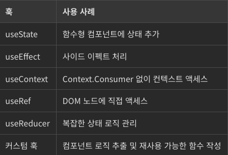

# React_Hook_2

## **React Hooks 소개 및 장점**

> `React Hooks` = `React 16.8`부터 도입
>
> **함수형 컴포넌트: `상태`, `사이트 이펙트` 관리하는 방식 변경**

### Hook 사용 장점

- **상태 로직 단순화**
  - 함수형 컴포넌트에 `상태` 추가 → **전반적인 로직 단순화, 코드 이해 쉬움**

- **코드 재사용성과 관심사 분리**
  - `Hooks` 사용 → 컴포넌트 계층 구조 변경 필요 없이 **여러 컴포넌트 간 상태 로직 재사용 가능**

- **사이드 이펙트 감소**
  - `사이트 이펙트 감소`: `Hooks`는 함수형 컴포넌트에 `생명주기 메서드와 유사한 기능 제공` → 사이드 이펙트 효율적 처리 가능 

### Hook 도입 동기

- **복잡한 컴포넌트의 이해가 어려워졌기 때문**
  - 시간이 지남에 따라 컴포넌트가 점점 커지고 복잡해짐 → 이해하기 어려워짐
  - `Hooks` = **컴포넌트의 모듈화** = **이해하기 쉬워짐**

- **클래스의 혼동** 
  - *(사람, 기게 모두)*
  
  - **`Javascript` 클래스**에 대한 이해 필요 = 높은 진입 장벽
  
  - 축소(`minification`), 핫리로딩(`hot reloading`) 문제 야기 가능성
    - `minification`
      - 웹 개발의 맥락에서 소스 코드의 기능을 변경하지 않고 불필요한 문자를 모두 제공하는 과정
      - 주로 **공백, 개행 문자, 주석 등** 포함
      - **코드의 크기를 줄여 웹사이트의 로딩 속도를 빠르게 하고 성능을 향상시킴**
      - `Terser`, `UglifyJS` 같은 도구들이 `Javascript`의 `minification`에 자주 사용됨

    - `Hot Reloading`
      - **업데이트된 모듈을 활성화된 런타임에 `즉시 적용`하는 기능**
      - 주로 `Webpack`, 개발 서버와 함께 사용
        - `React` 컴포넌트에 대한 **변경 사항을 실시간으로 확인 가능**
        - **현재 앱 상태를 유지한 채로 변경 사항 반영 가능**

      - 예시: `form` 작업 중 + 해당 폼에 데이터를 입력한 후 컴포넌트 코드를 변경하고자 할 때
        - `hot reloading`이 없다면 페이지 완전히 새로고침 → 폼 데이터 손실
        - `hot reloading` 사용: **컴포넌트 코드 업데이트 → 재렌더링 → (새로고침 없이) 폼과 다른 컴포넌트의 상태 유지 가능**

- **상태 관련 로직을 컴포넌트 간 재사용 어려웠기 때문**
  - 기존: `render props`, 고차 컴포넌트 같은 패턴 사용 → **번거로움**, **코드를 이해하기 어려움**
  - `Hooks` → **라이프사이클 메서드에 기반한 분할**, 관련 컴포넌트 기준으로 **작은 함수로 분할 가능**

<br>

## **자주 사용되는 `React Hooks`**

### **1) `useState`**

- **함수 컴포넌트에 `상태` `추가` 가능**
- **`현재 상태 값`, `해당 값을 업데이트하는 함수로 구성된 배열`을 반환**

- 예시

  ```jsx
    import React, { useState } from 'react';

    function Counter() {                                // Counter 컴포넌트 정의
    const [count, setCount] = useState(0);              // 상태 사용, count 변수 추적
    // count = 0으로 초기화, setCount = count 업데이트 함수

    return (
        <div>
        <p>You clicked {count} times</p>
        <button onClick={() => setCount(count + 1)}>    // 버튼 클릭 시, setCount = count+ 1 → 상태 업데이트, 재렌더링
            Click me
        </button>
        </div>
    );
    }

    export default Counter;
  ```

<br>

### **2) `useEffect`**

- **함수 컴포넌트에서 `Side Effect` 수행 가능**

- 인수 2개 필요
  - **`Side Effect` 로직이 포함된 함수**
  - **의존성 배열**

  - 인수 예시
    ```jsx
    useEffect(() => {
        document.title = `You clicked ${count} times`;
    }, [count]);                             // 'count' 값이 변경될 때마다 이 효과가 실행됨

    ```

- 활용 사이트 이펙트: `데이터 가져오기`, `구독`, `React 컴포넌트에서 DOM 직접 변경하기` 등

- 예시: *버튼이 클릭된 횟수에 따라 문서 제목 업데이트하는 것을 보여주는 함수*
  ```jsx
    import React, { useState, useEffect } from 'react';

    function Example() {
    const [count, setCount] = useState(0);

    // componentDidMount와 componentDidUpdate와 유사
    useEffect(() => {
        // 함수를 인자로 받아 매번 렌더링한 후에 해당 함수를 실행함
        document.title = `You clicked ${count} times`;
    });

    return (
        <div>
        <p>You clicked {count} times</p>
        <button onClick={() => setCount(count + 1)}>
            Click me
        </button>
        </div>
    );
    }

    export default Example;
  ```

<br>

### **3) `useContext`**

- **컴포넌트 트리에 `중첩을 추가하지 않고도` `React` 컨텍스트 구독 가능**

```jsx
const theme = useContext(ThemeContext);
                            // 컨텍스트 객체를 인수로 전달
                            // 현재 컨텍스트 값을 반환함

```

- 예시
```jsx
    import React, { useContext } from 'react';
    const ThemeContext = React.createContext('light');      // 기본값이 'light'인 컨텍스트 생성

    function ThemedButton() {                               // ThemeButton 컴포넌트에서 해당 컨텍스트 사용
    const theme = useContext(ThemeContext);                 // useContext에서 컨텍스트 인자, 현 컨텍스트 값 반환
                                                            // 이 경우 현 컨텍스트 값 = 'light'
    return <button theme={theme}>I'm styled by the theme context!</button>;
    }

    export default ThemedButton;
```

<br>

### **4) `useRef`**

- 전달된 인수로 초기화된 `.current` 속성을 가진 **가변적인 `ref` 객체를 생성하는 데 사용 가능**

```jsx
const inputEl = useRef(null);
```

- 반환된 객체 = 컴포넌트의 전체 수명 동안 지속

- 렌더링 사이에서 **`DOM 노드` or 다른 값 엑세스에 도움** 될 수 있음

- 예시

  ```jsx
  import React, { useRef } from 'react';

  function TextInputWithFocusButton() {
      const inputEl = useRef(null);
      const onButtonClick = () => {
          inputEl.current.focus();             // '.current' =  마운트된 텍스트 입력 요소
      };

      return (
          <>
          <input ref={inputEl} type="text" />
          <button onClick={onButtonClick}>Focus the input</button>
          </>
        );
      }

      export default TextInputWithFocusButton;
  ```

  - `useRef` 사용 → 텍스트 입력에 대한 참조 생성 
  
  ```jsx
      //해당 부분에 대한 코드
      const inputEl = useRef(null);
      const onButtonClick = () => {
          inputEl.current.focus();
      };
  ```
    - `inputEl` 참조 = 입력 요소에 연결
    - 버튼 클릭 = 이 참조를 사용해 입력에 포커스를 줌

<br>

### **5) `useReducer`**

- `useState`의 **대체제** 로 사용

- 사용 방법
  ```jsx
  const [state, dispatch] = useReducer(reducer, initialArg);
  ```

  - `(state, action) => newState` 유형의 리듀서를 받음 → **현재 상태**, **디스패치(`dispatch`) 메서드** `쌍으로 반환`

- 예시_1
  
```jsx
    import React, { useReducer } from 'react';

    const initialState = { count: 0 };

    function reducer(state, action) {
    switch (action.type) {
        case 'increment':                           // incremnet 액션 사용
        return { count: state.count + 1 };
        case 'decrement':                           // decrement 액션 사용
        return { count: state.count - 1 };
        default:
        throw new Error();
    }
    }

    function Counter() {
    const [state, dispatch] = useReducer(reducer, initialState);
                            // count 상태를 관리하기 위해 useReducer 사용
                            // 리듀서 함수, 초기 상태를 인자로 받아 현재 상태, 디스패치 함수를 반환함
    return (
        <>
        Count: {state.count}
        <button onClick={() => dispatch({ type: 'increment' })}>+</button>
        <button onClick={() => dispatch({ type:

    'decrement' })}>-</button>
        </>
    );
    }

    export default Counter;
```

- 예시_2

```jsx

    const [state, dispatch] = useReducer(reducer, initialState);
    const reducer = (state, action) => {
        switch (action.type) {
            case 'increment':
                return {count: state.count + 1};
            case 'decrement':
                return {count: state.count - 1};
            default:
                throw new Error();
        }
    };

```

<br>

## 재사용성과 관심사 분리를 위한 커스텀 훅 작성하기

- 커스텀 훅을 사용하면 컴포넌트 로직을 재사용 가능한 함수로 추출 가능
- 커스텀 훅은 **`use`** 로 시작하는 `JavaScript` 함수로, 다른 훅을 호출 가능 
  - 커스텀 훅을 만들면 컴포넌트 계층 구조를 변경하지 않고도 다른 컴포넌트 간에 상태 로직을 추상화하고 재사용

- 예시

```jsx
    function useWindowWidth() {             // useWindowWidth 컴스텀 훅 = 현재 창의 너비를 반환함 
    const [width, setWidth] = useState(window.innerWidth);

    useEffect(() => {
        const handleResize = () => setWidth(window.innerWidth);

        window.addEventListener('resize', handleResize);

        return () => {
        window.removeEventListener('resize', handleResize);
        };
    }, []);

    return width;
    }
```

<br>

### `Hook` 이용한 개발 예시

- **클래스를 작성하지 않고도 상태(`state`) 및 기타 `React` 기능을 사용할 수 있게 해줌**

- 예시_1: 입력 필드 업데이트 + 초기화 기능 처리하는 사용자 정의 훅 = **`useInput`훅**

```jsx
    import { useState } from "react";

    // 입력 필드를 처리하기 위한 사용자 정의 훅
    const useInput = (initialValue) => {
    const [value, setValue] = useState(initialValue);

    const handleChange = (e) => {
        setValue(e.target.value);
    };

    const handleReset = () => {
        setValue(initialValue);
    };

    return {
        value,
        onChange: handleChange,
        resetValue: handleReset,
    };
    };

    export default useInput;
```

  - `useInput` = 입력 필드를 업데이트하고 초기화하는 공통 로직을 처리하는 사용자 정의 훅

- 예시_2: **`useInput`** 사용자 정의 훅을 **컴포넌트에서 사용하는 방법**

```jsx
    import React from 'react';
    import useInput from './useInput';

    const FormComponent = () => {
    const { value: name, onChange: setName, resetValue: resetName } = useInput('');
    const { value: email, onChange: setEmail, resetValue: resetEmail } = useInput('');

    const handleSubmit = (e) => {
        e.preventDefault();
        console.log(name, email);
        resetName();
        resetEmail();
    };

    return (
        <form onSubmit={handleSubmit}>
        <input type="text" value={name} onChange={setName} placeholder="이름" required />
        <input type="email" value={email} onChange={setEmail} placeholder="이메일" required />
        <button type="submit">제출</button>
        </form>
    );
    };

    export default FormComponent;
```

  - `FormComponent` 컴포넌트 내에서 여러 필드 (이름, 이메일)에서 재사용
  - **`Hook`이 `상태 관련 로직`을 **서로 다른 컴포넌트 간에 재사용할 수 있게 해줌**

- **사용자 정의 훅에서 주의할 점**
  - 기능 **< `패턴`**
  - **컴포넌트 `로직`** = 재사용 가능한 `함수`로 `추출`하는 것

<br>

### 표: **`React Hooks`**

* 