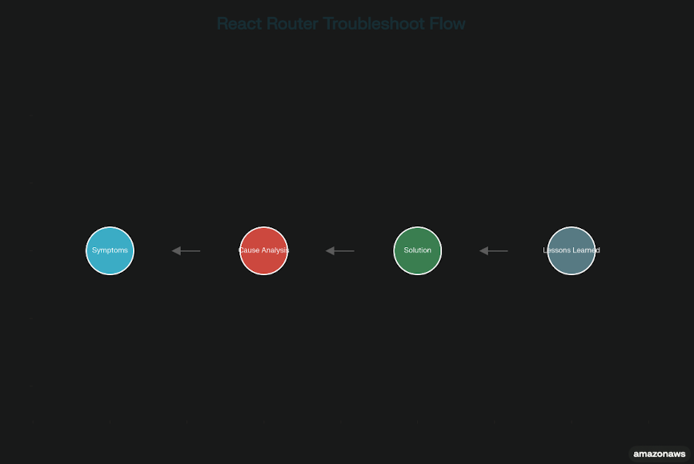

# 🛠️ React Router Navigation & Button Routing Troubleshooting

> 작성일: 2025-08-29  
> 작성자: Jay  
***

## 1. Dashboard Page Navigation Issue

### 1) 증상
- `/dashboard` 페이지에서 다른 페이지로 이동이 되지 않음
- 네비게이션 버튼 클릭 시 아무 반응 없음 (`URL`은 변경되나 아무런 변화가 없음)
- **새로고침(F5)을 해야만** 다른 페이지(`/home`, `/stats`, `/profile`, `/practice`)로 이동 가능
- Dashboard의 `"⚙️ 설정"`, `"📊 통계"` 버튼이 라우팅 연결되지 않음

### 2) 원인
- **React Router 컴포넌트 재사용 문제**: 같은 컴포넌트가 계속 마운트되어 React가 변화를 감지하지 못함
- **useEffect 의존성 배열 부족**: `location.pathname` 변화를 감지하지 못해 리렌더링되지 않음
- **Context 상태 충돌**: `incrementStepCount('step5')`가 계속 실행되면서 라우팅 방해

```jsx
    // ❌ 문제가 있던 코드

    useEffect(() => {
    incrementStepCount('step5');
    }, 
    [incrementStepCount]);                   // location 변화 감지 안됨
```

### 3) 해결 과정
- **1단계**: 버튼 라우팅 연결 확인
  ```jsx
    // Dashboard.js에 useNavigate 추가

    import { useNavigate } from 'react-router-dom';
    const navigate = useNavigate();            // 추가
    
    <button onClick={() => navigate('/settings')}>⚙️ 설정</button>
    <button onClick={() => navigate('/stats')}>📊 통계</button>
  ```

- **2단계**: `Settings` 컴포넌트 및 `CSS` 생성
  ```jsx

    // components/Settings.js 생성

    // components/Settings.css 생성
    
    // App.js에 Route 추가
  
  ```

- **3단계**: **`useLocation` 훅** → **경로 변화 감지 추가 ✅**
  ```jsx

    // ✅ 해결된 코드

    import { useLocation } from 'react-router-dom';
    const location = useLocation();
    
    useEffect(() => {
        if (location.pathname === '/dashboard') {
        incrementStepCount('step5');
        }
    }, [incrementStepCount, location.pathname]);          // location 의존성 추가
  
  ```

### 4) 결과 → **`해결`**
- `Dashboard` → `Settings`/`Stats` 버튼 클릭으로 **즉시 이동 ✅**
- `새로고침 없이`도 **매끄러운 네비게이션 작동 ✅**
- **모든 페이지 간 자유로운 이동 가능 ✅**

## 2. `Component-Level CSS` 구조화

### 1) 증상
- `Settings` 컴포넌트 생성 시 `CSS 파일 누락`으로 스타일 적용 안됨
- `"왜 CSS를 따로 만들어야 하는지?"`라는 의문

### 2) 해결 & 이유
- **컴포넌트별 CSS 분리**: 유지보수성, 모듈화, 스타일 충돌 방지
- **Settings.css 생성**: 독립적인 스타일 관리
- **import './Settings.css'**: 컴포넌트에 스타일 연결

### 3) 결과
- 깔끔한 파일 구조와 스타일 관리 체계 확립 ✅

## 3. `React Router 라우팅` 완성

### 1) 최종 구조
* 
```markodown
    App.js
    ├── /home → Home.js                 (Link 연결)
    ├── /dashboard → Dashboard.js       (버튼 → useNavigate 연결)  
    ├── /stats → Stats.js
    ├── /profile → Profile.js
    ├── /practice → Practice.js
    └── /settings → Settings.js         (신규 추가)
```

### 2) 네비게이션 연결점
- **NavBar**: 모든 메인 페이지 연결
- **Home 페이지**: 각각 `Link` 연결
- **Dashboard 페이지**: `버튼` → `Settings`, `Stats`로 navigate 연결


## 4. 교훈 & 베스트 프랙티스

### React Router 관련
- **useLocation 훅 활용**: 경로 변화 감지가 필요한 경우 의존성 배열에 `location.pathname` 추가
- **컴포넌트 재사용 시 주의**: 같은 컴포넌트가 `여러 라우트에서 사용될 때` **리렌더링 문제 발생 가능**
- **디버깅 팁**: 특정 페이지만 문제가 있다면 해당 페이지의 **`useEffect 의존성 배열` 점검 필요**

### 코드 구조화
- **컴포넌트별 CSS 분리**: 유지보수성과 모듈화를 위해 1:1 대응
- **단계별 문제 해결**: 버튼 연결 → 컴포넌트 생성 → 라우팅 문제 해결 순서
- **기존 코드 보존**: 기존 `Context`, `useEffect` 로직은 최대한 유지하며 최소한의 수정

### 개발 프로세스
- **문제 정확히 파악**: **`Dashboard에서만`**, **`새로고침 필요`** 등 구체적 증상 기술
- **다른 페이지와 비교**: 정상 작동하는 부분과 문제 부분 구분
- **단계별 해결**: 한 번에 모든 걸 고치려 하지 말고 하나씩 차근차근

### 참고
- 환경: `React 19.1.1`, `react-router-dom @7.8.2`
- 소요시간: `약 1시간` (문제 파악부터 해결까지)
- 핵심 해결책: **`useLocation + location.pathname 의존성 배열`**

***

* React Router Troubleshoot Flow Chart


***

* *출처: Perplexity Labs 대화 세션 (2025-08-29)*
* *참고: Perplexity, 클로드-4소넷, Chat-GPT*