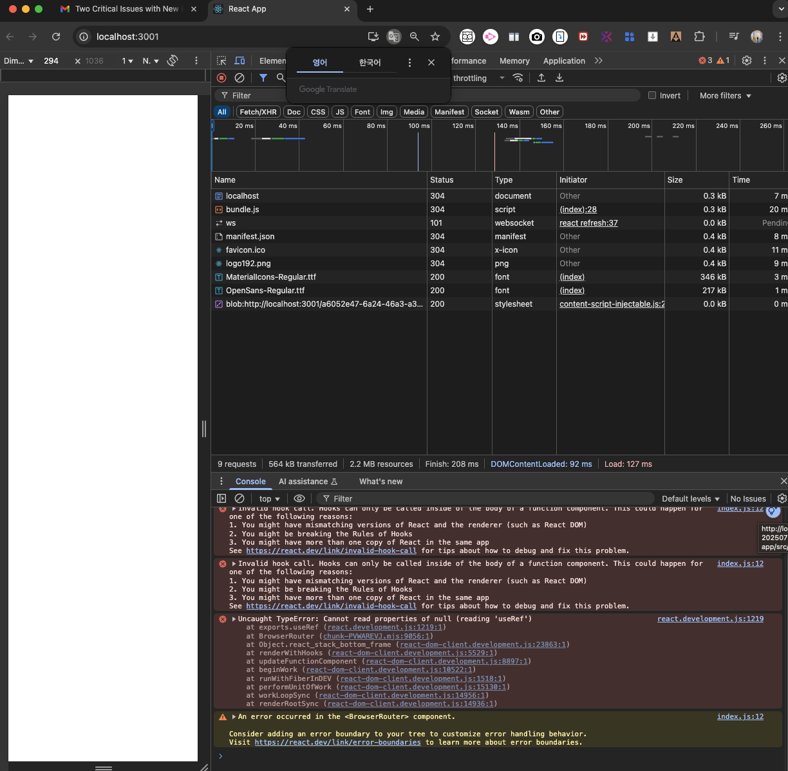
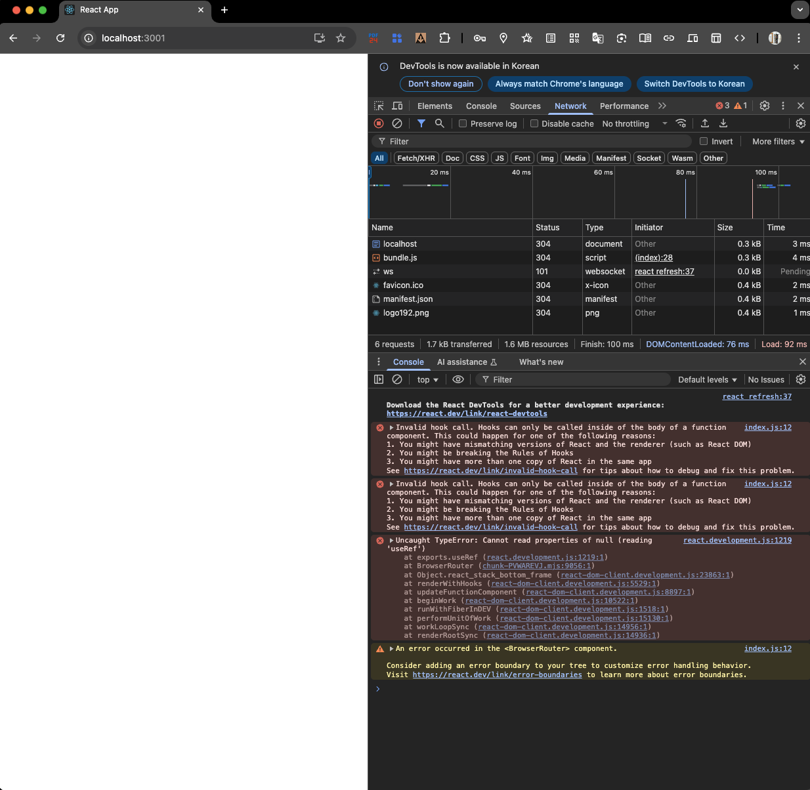
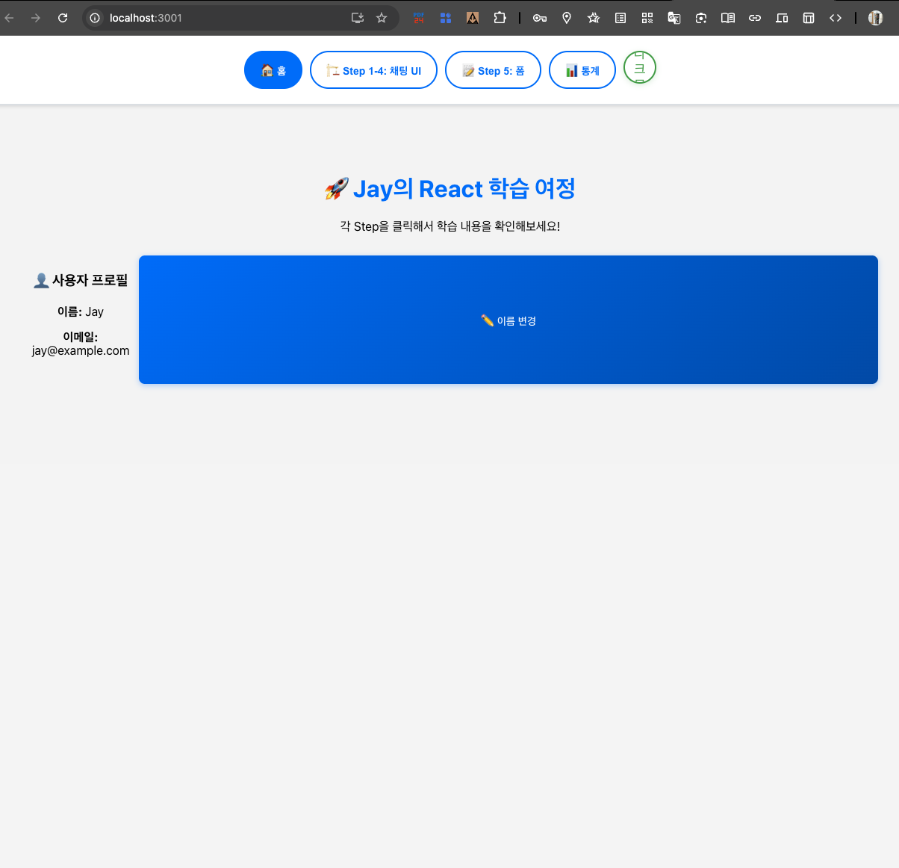

# 🛠️ React White Screen & Invalid Hook Call Troubleshooting

> 작성일: 2025-08-27  
> 작성자: Jay  
***

## 1. White Screen & "Invalid Hook Call" Error

### 1) 증상
- 브라우저에서 `localhost:3001/dashboard`에 접근 시 흰 화면(`white screen`)만 표시됨.
  - 
  - 

- 콘솔 에러: `Invalid hook call. Hooks can only be called inside of the body of a function component.`

- 추가 에러: `Cannot read properties of null (reading 'useRef')` 및 `<BrowserRouter> component error`

### 2) 원인
- **`React Hook`** (`useAppContext`, `useEffect`)이 함수형 컴포넌트 body 외부(중첩 함수, 조건문 등)에서 호출됨.
- `AppProvider`(`Context Provider`)가 `Router`/`App`을 제대로 감싸지 못해 `Context null` 발생.
- `import 이름 불일치` 
  - `App.js` - `AppContent export`
  - `index.js` - `App import`
- `npm audit fix --force`로 `react-scripts`가 `0.0.0`으로 **`다운그레이드`** → **`command not found`** 에러 발생.

### 3) 해결 과정
- **Hook 위치 확인**: Hook을 함수 body 최상위로 이동.
- **Provider/Router 위계 수정**: `index.js`에서 <AppProvider> → <BrowserRouter> → <App /> 순서로 감싸기.
- **import 이름 통일**: `App.js` 함수명을 `App`으로 변경 (`export default App;`).
- **npm audit fix --force 복구**:
  
  ```bash
  git restore package.json
  git restore package-lock.json
  rm -rf node_modules
  npm install
  npm start
  ```

- **Git reset으로 이전 커밋 복구**:
  
  ```bash
  git stash                     # 변경 백업
  git reset --hard a49a40b      # 정상 커밋으로 리셋
  git pull origin main
  git push -f origin main       # 원격 동기화
  ```

### 4) 결과
- 복구 후 `Step 6 상태`로 정상 복귀 (화면 표시됨).
- 취약점은 개발 중 무시 (`npm audit fix --force` 피함).

## 2. npm audit 취약점 지속 문제

### 1) 증상
- `npm install` 또는 `npm audit fix` 후 `9 vulnerabilities` (`3 moderate, 6 high`) 지속.
- 취약점: `nth-check`, `postcss`, `webpack-dev-server` 등 **`react-scripts`** 관련.

### 2) 원인
- `npm audit fix`는 안전한 패치(minor/patch)만 적용 **major 변경(breaking) 필요한 취약점 안 고침**
- `--force 옵션` → 오히려 `react-scripts`를 `0.0.0`으로 `다운그레이드`해 **앱 깨뜨림**

### 3) 해결
- 안전 모드 사용: `npm audit fix` ( **force 없이** )
- **수동 업그레이드** : `package.json`에서 `react-scripts` 버전 업데이트 (e.g., `^5.0.1`).
- 복구: `Git restore`로 `package 파일` 이전 상태 **`복원` + `재설치`**

## 3. Git Reset & Rollback

### 1) 증상
- 프로젝트 꼬여 흰 화면 반복, `npm 에러`로 `npm start 실패`

### 2) 원인
- 변경 사항(`uncommitted 파일`, `npm force`)으로 상태 엉망.

### 3) 해결
- `Stash 백업` + `hard reset`으로 **이전 커밋 버전으로 복구**
- 결과: ***`Step 6 상태`로 복귀 성공**
- 

## 4. 교훈 & 베스트 프랙티스
- **Hook 규칙 준수**: `Hook`은 함수형 컴포넌트 body `최상위`에서만 호출, `대문자 함수명` 사용.
- **Provider/Router 위계**: `index.js`에서 `Provider`가` Router를 감싸도록`
- **npm audit**: `--force 피하고`, 안전 fix + 수동 업데이트!
- **Git 활용**: `작은 커밋 자주`, `reset --hard로 리셋`, `stash로 백업`
- **디버깅 팁**: `최소 렌더링`(Hello world)부터 점진 확장, **`콘솔/네트워크 탭` 활용하기!**
- **스트레스 관리**: 꼬이면 `Git reset`으로 새 출발 → **오늘처럼 한 번에 `reset` 가능!**

### 참고
- 환경: `macOS`, `pyenv`, `React 19.1.1`, `react-scripts 5.0.1.`
- 소요시간: `약 3시간` (디버깅 과정에서 배운 점 많음... ㅠㅠ).
- 링크: [React Invalid Hook Call Warning](https://react.dev/warnings/invalid-hook-call-warning).

***

* 출처
  * [1] OutputParser_Datetime_troubleshooting.md https://ppl-ai-file-upload.s3.amazonaws.com/web/direct-files/attachments/35543904/9ce144da-b95c-47ee-a19c-de0da7d575f8/OutputParser_Datetime_troubleshooting.md
  * [2] pyenv_troubleshooting_20250809.md https://ppl-ai-file-upload.s3.amazonaws.com/web/direct-files/attachments/35543904/381faa7c-62e8-4c20-b522-364470e57b5c/pyenv_troubleshooting_20250809.md
  * [3] Fewshot_Templating_Troubleshooting.md https://ppl-ai-file-upload.s3.amazonaws.com/web/direct-files/attachments/35543904/f7c9f68f-f71c-40a8-bb7c-e67685008532/Fewshot_Templating_Troubleshooting.md

***
